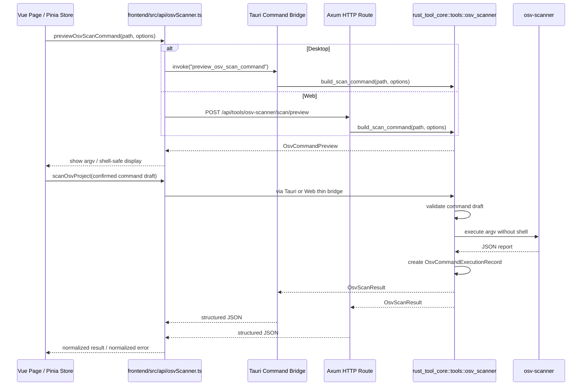

# OSV 本地漏洞扫描管理器 - 实施计划

本计划旨在将 **OSV 依赖漏洞扫描管理器 (OSV Dependency Security Manager)** 作为全新功能集成到 RustTool 中。实现必须遵守项目黄金手册：桌面版 Tauri 与 Web 版 Axum 共享同一套 Vue 页面，核心业务逻辑沉淀在 `crates/rust_tool_core`，Tauri Command 与 HTTP Route 都只是薄入口层。

---

## 1. 产品范围与交付分期

### 1.1 第一阶段：手动扫描闭环 (MVP)

目标是先建立稳定、可验证的本地依赖安全治理闭环：

1. 检测本机是否可用 `osv-scanner`。
2. 添加、移除、保存受监控项目列表。
3. 对单个项目执行手动扫描前，生成可审查的命令预览。
4. 允许用户在受控范围内调整扫描参数，并在确认后执行。
5. 运行完成后保存本次执行的命令快照、时间、退出码和结果摘要，支持追溯。
6. 解析 `osv-scanner` JSON 输出为强类型数据。
7. 在 UI 中展示项目健康分、漏洞数量、严重级别、受影响依赖路径和修复建议。
8. 支持导出扫描报告，MVP 至少提供 JSON 与 HTML 两种格式选择。
9. 支持对确认无风险的漏洞写入或更新项目本地 `osv-scanner.toml` 忽略规则。
10. 桌面与 Web 使用同一个 Vue 页面和同一套前端 API 适配层。

### 1.2 第二阶段：修复与主动防护

在 MVP 稳定后再进入高风险能力：

1. 一键修复：执行 `osv-scanner` 支持的修复命令，并在 UI 中明确提示会修改项目锁文件。
2. 后台定时扫描：支持 daily、weekly、none 等策略。
3. macOS 系统通知：后台扫描发现新增 Critical 或 High 漏洞时主动提醒。
4. 扫描历史与趋势：保存最近扫描摘要，用于对比健康分变化。

---

## 2. 核心架构与功能流向



关键原则：

1. Vue 页面和 Pinia Store 不直接散落 `fetch` 或 `invoke`。
2. `frontend/src/api/osvScanner.ts` 是唯一前端调用后端能力的适配层。
3. Tauri 与 Axum 只做入参校验、错误映射和调用 core，不承载业务逻辑。
4. 所有命令生成、命令校验、扫描、解析、评分、忽略规则写入、修复命令封装在 `rust_tool_core`。
5. UI 展示的是 shell-safe command string，但实际执行必须使用 `argv: Vec<String>`，不经过 shell。

### 2.1 命令透明与追溯原则

`osv-scanner` 执行不能是黑盒，必须支持“执行前可审查、执行中可感知、执行后可追溯”：

1. 扫描和修复命令执行前必须先生成 `OsvCommandPreview`，展示二进制路径、工作目录、参数数组、等价的 shell-safe 命令字符串和预计影响。
2. 用户调整命令时优先使用结构化控件，例如递归扫描、配置文件路径、锁文件路径、是否使用忽略规则等。
3. 如提供高级参数输入，只能作为 `osv-scanner` 参数追加，并必须经过 allowlist 校验；不得允许任意 shell 片段、管道、重定向、命令替换、环境变量赋值或切换到其他二进制。
4. 为保证 JSON 解析稳定，MVP 中 `scan source`、`--format json`、目标项目路径等关键参数默认锁定，除非实现了对应解析与验证。
5. 执行请求必须携带用户确认过的命令草稿；core 在执行前重新校验，校验后的 `argv` 才是最终执行来源。
6. 扫描完成后 `OsvScanResult` 必须包含 `OsvCommandExecutionRecord`，记录当时实际执行的 `argv`、展示命令、工作目录、开始/结束时间、耗时、退出码、状态、结果摘要和受限 stderr 摘要。
7. 命令历史只保存最近有限条数，默认 50 条；不长期保存完整 stdout JSON，避免漏洞报告或依赖路径过度膨胀。
8. UI 需要提供“查看本次命令”和“复制命令”能力，便于用户复现或审计。
9. 应用内扫描模式固定使用 `--format json` 作为解析来源；报告导出模式允许用户选择 `json` 或 `html`。
10. HTML 导出使用 `--format html --output-file <path>` 生成静态文件，不把 `--serve` 作为 MVP 默认路径，避免端口占用和后台进程生命周期问题。

---

## 3. 待修改与新增文件

### 3.1 Rust 核心业务层：`crates/rust_tool_core`

#### [NEW] `crates/rust_tool_core/src/tools/osv_scanner.rs`

职责：封装与本地 `osv-scanner` CLI 交互、结果解析、健康评分、忽略规则维护。

建议接口：

```rust
pub fn check_osv_scanner_installed() -> Result<OsvInstallStatus, OsvScannerError>;
pub fn build_scan_command(
    request: OsvScanCommandRequest,
) -> Result<OsvCommandPreview, OsvScannerError>;
pub fn scan_project(request: OsvScanRequest) -> Result<OsvScanResult, OsvScannerError>;
pub fn build_export_command(
    request: OsvReportExportCommandRequest,
) -> Result<OsvCommandPreview, OsvScannerError>;
pub fn export_report(request: OsvReportExportRequest) -> Result<OsvReportExportResult, OsvScannerError>;
pub fn ignore_vulnerability(
    project_path: &str,
    vulnerability_id: &str,
    reason: &str,
) -> Result<OsvIgnoreResult, OsvScannerError>;
pub fn apply_fix(path: &str) -> Result<OsvFixResult, OsvScannerError>;
```

实现要求：

1. 使用 `thiserror` 定义 `OsvScannerError`，核心层不要以 `String` 作为主要错误类型。
2. 执行外部命令必须使用 `std::process::Command` 参数数组，不经过 shell。
3. 命令预览、命令校验和命令执行都在 core 中完成，Tauri/Axum 不拼接命令。
4. 项目路径必须 `canonicalize`，并校验为目录。
5. 不记录依赖文件中的敏感内容，不把完整命令输出无筛选写入日志。
6. JSON 输出使用强类型 `serde` 结构体解析，保留兼容未知字段的空间。
7. `osv-scanner.toml` 维护应使用 TOML 解析/编辑库或结构化写入，避免字符串拼接造成重复或破坏原配置。
8. 报告导出格式 MVP 仅允许 `json` 和 `html`；其他格式如 SARIF、Markdown 后续再开放。
9. 导出文件路径必须由应用生成或经用户明确选择，并限制扩展名与格式一致。
10. `apply_fix` 属于第二阶段，实现前必须先用本机 `osv-scanner --help` 验证当前版本的参数和行为。

核心数据结构建议：

```rust
#[derive(Debug, Clone, Deserialize, Serialize)]
#[serde(rename_all = "camelCase")]
pub struct OsvCommandPreview {
    pub kind: OsvCommandKind,
    pub binary: String,
    pub working_dir: String,
    pub argv: Vec<String>,
    pub display_command: String,
    pub locked_args: Vec<String>,
    pub editable_options: OsvCommandEditableOptions,
    pub warnings: Vec<String>,
}

#[derive(Debug, Clone, Deserialize, Serialize)]
#[serde(rename_all = "camelCase")]
pub struct OsvCommandExecutionRecord {
    pub id: String,
    pub kind: OsvCommandKind,
    pub project_path: String,
    pub working_dir: String,
    pub argv: Vec<String>,
    pub display_command: String,
    pub started_at: String,
    pub finished_at: Option<String>,
    pub duration_ms: Option<u64>,
    pub exit_code: Option<i32>,
    pub status: OsvCommandStatus,
    pub summary: String,
    pub stderr_excerpt: Option<String>,
}

#[derive(Debug, Clone, Copy, Deserialize, Serialize)]
#[serde(rename_all = "camelCase")]
pub enum OsvReportFormat {
    Json,
    Html,
}

#[derive(Debug, Clone, Deserialize, Serialize)]
#[serde(rename_all = "camelCase")]
pub struct OsvReportExportResult {
    pub format: OsvReportFormat,
    pub output_path: String,
    pub command: OsvCommandExecutionRecord,
}
```

#### [MODIFY] `crates/rust_tool_core/src/tools/mod.rs`

导出 `osv_scanner` 模块。

#### [MODIFY] `crates/rust_tool_core/src/lib.rs`

按现有 `vless_to_mihomo` 模式导出 OSV 相关函数和数据结构，供 Tauri、Axum、CLI 后续复用。

#### [MODIFY] `crates/rust_tool_core/Cargo.toml`

如需要结构化维护 `osv-scanner.toml`，增加合适的 TOML 编辑依赖。优先选择能保留已有配置结构的库。

### 3.2 Axum Web 薄入口：`crates/rust_tool_server`

#### [NEW] `crates/rust_tool_server/src/routes/osv_scanner.rs`

职责：提供 Web 版 HTTP API，调用 `rust_tool_core`。

建议路由：

1. `GET /api/tools/osv-scanner/install-status`
2. `POST /api/tools/osv-scanner/scan/preview`
3. `POST /api/tools/osv-scanner/scan`
4. `POST /api/tools/osv-scanner/export/preview`
5. `POST /api/tools/osv-scanner/export`
6. `POST /api/tools/osv-scanner/ignore`
7. `POST /api/tools/osv-scanner/fix/preview`，第二阶段启用
8. `POST /api/tools/osv-scanner/fix`，第二阶段启用

错误格式必须保持：

```json
{
  "error": {
    "code": "osv_scan_failed",
    "message": "扫描失败，请确认项目路径和 osv-scanner 安装状态"
  }
}
```

建议错误码：

1. `osv_not_installed`
2. `invalid_project_path`
3. `osv_scan_failed`
4. `osv_report_parse_failed`
5. `osv_ignore_update_failed`
6. `osv_fix_failed`
7. `osv_command_rejected`
8. `osv_export_failed`
9. `invalid_report_format`

#### [MODIFY] `crates/rust_tool_server/src/routes/mod.rs`

导出 `osv_scanner` 路由模块。

#### [MODIFY] `crates/rust_tool_server/src/app.rs`

注册 OSV HTTP 路由。若新增非 GET/POST 方法，需要同步更新 CORS `allow_methods`。

### 3.3 Tauri 桌面薄入口：`frontend/src-tauri`

#### [MODIFY] `frontend/src-tauri/src/lib.rs`

职责：注册 OSV Tauri Commands，并管理桌面端本地配置。

新增 settings：

```rust
#[derive(Debug, Clone, Default, Deserialize, Serialize)]
#[serde(default, rename_all = "camelCase")]
pub struct OsvProjectSettings {
    pub name: String,
    pub path: String,
    pub last_scanned: Option<String>,
    pub health_score: Option<u32>,
}

#[derive(Debug, Clone, Deserialize, Serialize)]
#[serde(default, rename_all = "camelCase")]
pub struct OsvScannerSettings {
    pub projects: Vec<OsvProjectSettings>,
    pub auto_scan_schedule: String,
    pub command_history: Vec<OsvCommandExecutionRecord>,
}
```

新增 commands：

1. `get_osv_settings`
2. `save_osv_settings`
3. `check_osv_installed`
4. `preview_osv_scan_command(request: OsvScanCommandRequest)`
5. `scan_osv_project(request: OsvScanRequest)`
6. `preview_osv_report_export_command(request: OsvReportExportCommandRequest)`
7. `export_osv_report(request: OsvReportExportRequest)`
8. `ignore_osv_vulnerability(project_path: String, id: String, reason: String)`
9. `preview_osv_fix_command(request: OsvFixCommandRequest)`，第二阶段启用
10. `fix_osv_project(request: OsvFixRequest)`，第二阶段启用

要求：

1. Commands 仅做桥接，不实现扫描业务。
2. 错误消息给前端时必须是业务可读信息，不暴露底层堆栈。
3. `save_osv_settings` 需要限制 `command_history` 条数，默认保留最近 50 条。
4. 第二阶段如加通知能力，优先使用 Tauri 官方通知插件，并明确权限处理。

### 3.4 前端统一适配层：`frontend/src/api`

#### [NEW] `frontend/src/api/osvScanner.ts`

职责：唯一封装 OSV 后端调用。

接口建议：

```ts
export async function getOsvSettings(): Promise<OsvScannerSettings>
export async function saveOsvSettings(settings: OsvScannerSettings): Promise<OsvScannerSettings>
export async function checkOsvInstalled(): Promise<OsvInstallStatus>
export async function previewOsvScanCommand(request: OsvScanCommandRequest): Promise<OsvCommandPreview>
export async function scanOsvProject(request: OsvScanRequest): Promise<OsvScanResult>
export async function previewOsvReportExportCommand(request: OsvReportExportCommandRequest): Promise<OsvCommandPreview>
export async function exportOsvReport(request: OsvReportExportRequest): Promise<OsvReportExportResult>
export async function ignoreOsvVulnerability(payload: IgnoreOsvVulnerabilityRequest): Promise<OsvIgnoreResult>
export async function previewOsvFixCommand(request: OsvFixCommandRequest): Promise<OsvCommandPreview>
export async function fixOsvProject(request: OsvFixRequest): Promise<OsvFixResult>
```

要求：

1. Tauri 环境走 `@tauri-apps/api/core` 的 `invoke`。
2. Web 环境走 `/api/tools/osv-scanner/*` HTTP 路由。
3. Web 端 settings 可先使用 `localStorage`，后续如需要多端统一再迁入服务端配置。
4. 执行扫描前必须先调用 preview 接口，不能在页面内临时拼命令。
5. 导出报告前必须先调用 export preview 接口，让用户确认格式、输出路径和命令。
6. 扫描或导出完成后把 `OsvCommandExecutionRecord` 写入 settings 中的历史记录，保留最近 50 条。
7. 统一解析 `{ error: { code, message } }`，向 UI 抛出稳定错误。

### 3.5 前端状态与页面：`frontend/src`

#### [NEW] `frontend/src/stores/osvScanner.ts`

职责：维护项目列表、扫描状态、当前命令预览、当前详情、最近扫描结果、命令历史、全局健康评分。

注意：

1. Pinia 保存全局项目配置和扫描摘要。
2. 单次请求中的临时局部状态不要过度塞入全局 Store。
3. 扫描结果中可能很大的原始依赖树不要永久写入 localStorage。
4. 命令历史保存执行快照和摘要，不保存完整 stdout JSON。

#### [NEW] `frontend/src/pages/OsvScanner.vue`

职责：OSV 管理器主界面。

MVP 页面模块：

1. 顶部状态区：安装状态、全局健康分、漏洞汇总。
2. 项目列表：添加、移除、扫描、查看详情。
3. 命令预览确认区：展示即将执行的命令、工作目录、锁定参数、可调整参数和风险提示。
4. 报告导出区：对当前项目或最近扫描结果选择 `JSON` 或 `HTML` 导出，并展示导出命令预览。
5. 详情抽屉：按严重级别排序展示漏洞、受影响路径、修复建议、忽略操作。
6. 命令历史：展示最近执行记录，可查看和复制当时命令。
7. 配置区域：自动扫描策略字段先保留，第二阶段接入真实后台任务。

交互要求：

1. 桌面端添加项目优先使用 `@tauri-apps/plugin-dialog` 选择目录。
2. Web 端提供手动输入路径或粘贴路径，提示该路径必须是后端服务可访问的本机路径。
3. 点击扫描先打开命令预览，不直接执行。
4. 命令调整使用结构化控件；如开放高级参数，必须展示校验失败原因。
5. 导出按钮必须让用户先选择 `JSON` 或 `HTML`，再确认输出路径和命令。
6. 一键修复在第二阶段必须弹确认框，说明会修改锁文件，并展示修复命令预览。
7. 忽略漏洞必须要求填写原因。

#### [MODIFY] `frontend/src/stores/tools.ts`

在工具箱导航中加入 “OSV 漏洞管理”。

#### [MODIFY] `frontend/src/router/index.ts`

注册 `/toolbox/osv-scanner` 页面，并按现有模式可保留 `/tools/osv-scanner` redirect。

#### [MODIFY] `frontend/src/pages/Toolbox.vue`

增加 OSV 模块快捷入口。

---

## 4. UI 与主题约束

视觉目标保留“本地安全看板”的科技感，但实现必须服从现有主题系统：

1. 不在 Vue 组件中大面积硬编码颜色或结构样式。
2. 优先复用全局主题变量、已有 `ToolShell`、状态徽标、卡片网格与 shadcn 组件。
3. 健康分颜色可以抽象为语义类，例如 `health-good`、`health-warning`、`health-danger`，具体颜色在全局样式中映射。
4. 健康环、扫描态、漏洞严重度标签允许有轻量动效，但不得造成布局跳动。
5. 按钮使用 lucide 图标表达扫描、修复、忽略、移除等动作，并为不直观图标提供 tooltip 或可访问标签。
6. 页面第一屏应是实际工具界面，不做营销式 landing page。

---

## 5. 安全与边界要求

1. 不扫描未经用户添加或输入确认的任意全盘路径。
2. 不把依赖文件、锁文件、漏洞报告中的潜在敏感内容发送给 AI 或外部服务。
3. `osv-scanner` 自身访问 OSV 数据库属于工具行为，UI 应在安装状态或说明中让用户理解其网络依赖。
4. `apply_fix` 会修改项目文件，第二阶段必须有显式确认和执行结果摘要。
5. 忽略规则只写入目标项目的 `osv-scanner.toml`，不得修改用户其他目录。
6. 路径、漏洞 ID、忽略原因都要做长度和格式约束。
7. 可编辑命令不等于可执行任意命令；二进制、子命令和关键输出格式必须由 core 校验。
8. 命令展示字符串仅用于阅读和复制，执行来源必须是校验后的 `argv`。
9. 命令历史中的 stderr 只保存截断摘要，避免把依赖解析细节或本机路径无限制持久化。
10. 高级参数 allowlist 必须有测试覆盖，拒绝 shell 控制字符、路径逃逸和未知高风险参数。
11. 报告导出只允许写入用户选择或应用生成的安全路径，不能覆盖项目源码文件、锁文件或配置文件。
12. HTML 报告作为本地静态文件处理，不自动启动本地 HTTP 服务，除非后续功能单独设计权限和生命周期。

---

## 6. 验证与测试方案

### 6.1 Rust 核心测试

1. JSON 解析测试：使用预设 `osv-scanner` JSON 样例反序列化为 `OsvScanResult`。
2. 健康评分测试：覆盖无漏洞、High/Critical、多漏洞组合。
3. 忽略规则测试：新增规则、重复规则、已有配置保留、非法 ID 拒绝。
4. 路径校验测试：不存在路径、文件路径、有效目录。
5. 命令失败映射测试：模拟 `osv-scanner` 不存在或返回非零状态。
6. 命令预览测试：确认默认扫描命令的 `argv`、工作目录和展示字符串一致。
7. 命令校验测试：拒绝替换二进制、删除 `--format json`、插入 shell 操作符或未知高风险参数。
8. 执行记录测试：成功和失败时都生成 `OsvCommandExecutionRecord`，并正确截断 stderr。
9. 报告导出测试：JSON 与 HTML 格式生成正确 `argv`，拒绝未知格式和不匹配扩展名。

### 6.2 Web/Tauri 入口测试

1. Axum 路由返回统一错误格式。
2. Tauri command 错误映射为前端可读消息。
3. Preview 与执行接口都不允许绕过 core 校验。
4. 前端 API 适配层分别覆盖 Tauri 分支和 Web 分支。

### 6.3 前端验证

1. 运行 `pnpm run build`。
2. 验证安装状态、添加项目、命令预览、参数调整、扫描中状态、空结果、漏洞结果、JSON/HTML 导出、忽略确认、命令历史。
3. 验证未确认命令时无法执行扫描，高级参数非法时给出可读错误。
4. Web 模式使用 `./rt dev`，桌面模式使用 `./rt desktop`。

### 6.4 集成手动验证

建议使用隔离数据目录：

```bash
RUSTTOOL_DATA_DIR=/private/tmp/rusttool-verify ./rt server
```

手动流程：

1. 打开 OSV 页面，检查安装状态。
2. 添加一个测试项目路径。
3. 点击扫描，先检查命令预览是否符合预期。
4. 调整允许的扫描参数，确认预览实时更新或重新生成。
5. 确认执行，查看结果是否按严重程度展示。
6. 打开命令历史，确认能追溯本次实际执行的命令、时间、退出码和摘要。
7. 分别导出 JSON 与 HTML 报告，确认输出文件存在且命令历史可追溯导出命令。
8. 对单个漏洞写入忽略规则，确认 `osv-scanner.toml` 合法且无重复。
9. 重新扫描，确认忽略规则生效。
10. 第二阶段再验证一键修复和系统通知。

---

## 7. 待确认事项

1. 本机目标 `osv-scanner` 版本及命令参数，特别是 `fix` 子命令行为。
2. OSV JSON 输出样例是否覆盖 Rust、Node、Go 等项目类型。
3. Web 端项目路径输入是否需要额外白名单根目录。
4. 后台定时扫描由 Tauri 桌面端负责，还是后续在 server 中提供常驻任务。
5. 扫描历史是否只保存摘要，还是保存完整漏洞报告。
6. MVP 中允许用户调整哪些 `osv-scanner` 参数，需要以目标版本 `--help` 为准建立 allowlist。
7. 命令历史保存位置：桌面端保存在应用 settings，Web 端先保存在 localStorage，后续是否迁入 server 数据目录。
8. JSON/HTML 报告默认导出目录：桌面端是否使用 Downloads，Web 端是否使用 server 数据目录或由用户输入绝对路径。
