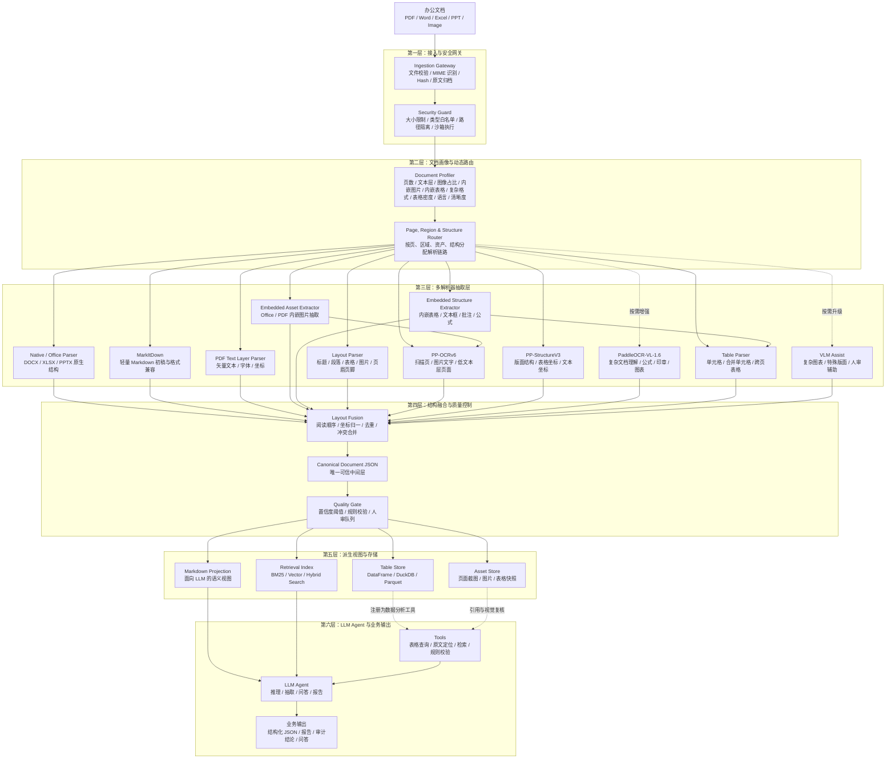

# 办公文档智能解析系统 - 架构设计文档

## 1. 架构定位

本系统定位为企业级/生产级的 **Document AI Pipeline**，目标不是简单把文档转成 Markdown，而是把 PDF、Word、Excel、PPT、图片和扫描件解析为可追溯、可校验、可检索、可供大模型调用的结构化知识资产。

核心原则：

1. **结构化中间表示优先**：`Canonical Document JSON` 是系统主数据模型，Markdown、HTML、DataFrame、向量索引只是派生视图。
2. **页级/区域级/资产级/结构级动态路由**：不按整个文档粗暴二分，而是按页面、区域、内嵌图片、内嵌表格、复杂格式和元素类型选择最合适的解析器。
3. **专用模型做专用任务**：Office 原生解析、PDF 文本层解析、OCR、版面分析、表格识别、LLM 推理各司其职。
4. **LLM 负责推理而非底层解析**：大模型用于跨页理解、字段归纳、业务判断和工具调用，不承担所有 OCR、表格结构恢复和数据清洗。
5. **置信度与溯源闭环**：每个解析结果都应保留来源、页码、坐标、置信度和版本，关键字段支持人工复核与审计。

## 2. 推荐架构全景



## 3. 核心数据模型：Canonical Document JSON

生产系统应避免把 Markdown 当成唯一真实来源。推荐将所有解析器输出统一融合到 `Canonical Document JSON`，再按使用场景导出 Markdown、HTML、DataFrame、Parquet 或向量索引。

### 3.1 顶层结构

```json
{
  "document_id": "sha256:...",
  "source": {
    "filename": "contract.pdf",
    "mime_type": "application/pdf",
    "page_count": 12,
    "hash": "..."
  },
  "pipeline": {
    "version": "doc-ai-pipeline-v1",
    "created_at": "2026-06-17T00:00:00Z"
  },
  "pages": [],
  "blocks": [],
  "tables": [],
  "assets": [],
  "quality": {
    "overall_confidence": 0.94,
    "requires_review": false
  }
}
```

### 3.2 Block 结构

```json
{
  "id": "blk_0001",
  "page": 1,
  "type": "paragraph",
  "text": "本合同由以下双方签署...",
  "bbox": [72.1, 128.4, 512.8, 172.0],
  "reading_order": 12,
  "confidence": 0.98,
  "source_engine": "pdf_text_layer",
  "provenance": {
    "file_hash": "...",
    "page_image": "assets/page_001.png",
    "engine_version": "..."
  }
}
```

### 3.3 Table 结构

```json
{
  "id": "tbl_0001",
  "page_start": 3,
  "page_end": 4,
  "title": "付款计划",
  "source_container": "contract.docx",
  "source_location": {
    "page": 3,
    "paragraph_id": "p_0042",
    "sheet": null,
    "range": null
  },
  "bbox": [54.0, 220.0, 540.0, 760.0],
  "columns": ["期次", "付款条件", "金额", "到期日"],
  "complexity": {
    "has_merged_cells": true,
    "is_nested_table": false,
    "is_cross_page": true,
    "has_formula_cells": false,
    "has_hidden_rows_or_columns": false
  },
  "cells": [
    {
      "row": 1,
      "col": 1,
      "rowspan": 1,
      "colspan": 1,
      "text": "第一期",
      "confidence": 0.97,
      "bbox": [60.0, 250.0, 120.0, 278.0]
    }
  ],
  "normalized": {
    "dataframe_ref": "tables/tbl_0001.parquet",
    "markdown_ref": "tables/tbl_0001.md"
  }
}
```

### 3.4 Asset 结构

Word、PDF、Excel 中可能包含截图、盖章件、签收照片、扫描片段或图表。它们不能只作为装饰被丢弃，应抽取为 `assets`，必要时进入 OCR、人审或可选视觉辅助链路。

```json
{
  "id": "img_0001",
  "type": "embedded_image",
  "source_container": "reconciliation.xlsx",
  "source_location": {
    "sheet": "对账明细",
    "cell_anchor": "G18",
    "page": null,
    "block_id": null
  },
  "file_ref": "assets/img_0001.png",
  "bbox": null,
  "ocr_block_ids": ["blk_0101"],
  "confidence": 0.86,
  "needs_review": true
}
```

## 4. 分层职责

### 4.1 接入与安全网关

职责：

- 校验文件大小、扩展名、MIME、页数、压缩包深度。
- 生成文件 Hash，保存原始文件和处理任务元数据。
- 隔离不可信文件解析过程，限制路径访问、网络访问和执行权限。
- 对加密文档、损坏文件、超大文件做明确错误分类。

原因：办公文档解析属于高风险输入处理，生产环境不能直接把用户上传文件交给高权限解析进程。

### 4.2 文档画像与动态路由

职责：

- 判断每页是否有 PDF 文本层、图片占比、分辨率、旋转角度、清晰度。
- 判断 Word、Excel、PDF 是否包含内嵌图片、截图、盖章件、签收照片或图表。
- 判断 Word、Excel、PDF 是否包含内嵌表格、嵌套表格、合并单元格、文本框、批注、脚注、公式、隐藏行列、透视表等复杂结构。
- 检测可能存在的表格、表单、印章、签名、公式、图表、页眉页脚。
- 输出路由决策，而不是直接输出最终文本。

推荐路由策略：

| 场景 | 首选链路 | 备用链路 |
|------|----------|----------|
| DOCX / PPTX / XLSX | 原生结构解析 | MarkItDown |
| 文本型 PDF | PDF text layer + Layout Parser | MarkItDown |
| Word / Excel / PDF 内嵌图片 | Embedded Asset Extractor + PP-OCRv6 | 人工复核 |
| Word / Excel / PDF 内嵌表格 | Embedded Structure Extractor + Table Parser | 人工复核 |
| Word / Excel / PDF 复杂格式 | Embedded Structure Extractor + Structure Normalizer | 人工复核 |
| 扫描 PDF / 图片 | PP-OCRv6 | PP-StructureV3 / 人工复核 / 可选 PaddleOCR-VL-1.6 辅助 |
| 复杂表格 | Table Parser + Pandas/DuckDB | OCR + 表格重建 |
| 图表 / 流程图 | 图片资产保留 + 人工复核 | 可选 VLM 辅助摘要 |
| 低置信关键字段 | 二次解析 / 人工复核 | 规则标红 |

### 4.3 多解析器抽取层

各组件定位：

- `MarkItDown`：轻量、快速、格式覆盖广，适合作为办公文档转 Markdown 的初稿生成器和兼容入口。
- `Embedded Asset Extractor`：从 Word、Excel、PDF 中抽取内嵌图片，记录来源页、Sheet、单元格锚点、段落或块关系，再按需进入 OCR 或人审。
- `Embedded Structure Extractor`：从 Word、Excel、PDF 中抽取内嵌表格、嵌套表格、文本框、批注、脚注、公式、隐藏行列、透视表等复杂结构，并保留原始来源关系。
- `PP-OCRv6`：PaddleOCR 3.7.0 的默认 OCR 主链路，负责扫描页、图片文字、内嵌图片文字检测与识别，适合 CPU 低并发部署。
- `PP-StructureV3`：负责视觉文档的版面结构、表格单元格坐标、文本坐标等细粒度结构化输出，适合扫描件、图片表格、复杂视觉 PDF 的可追溯解析。
- `PaddleOCR-VL-1.6`：文档解析 VLM，适合公式、印章、图表、复杂表格和复杂图文混排理解，支持 Markdown / JSON 输出；在本方案中作为高复杂文档增强能力，默认不替代 `PP-OCRv6` 和 `PP-StructureV3`。
- `PDF Text Layer Parser`：优先读取矢量文本、字体、坐标和页面对象，避免对文本型 PDF 做不必要 OCR。
- `Table Parser`：对表格做二维结构恢复，保留表头、合并单元格、跨页关系和数值类型。
- `Pandas / DuckDB / Parquet`：承接结构化表格清洗、类型推断、查询、聚合和大表持久化。
- `VLM`：只作为高成本可选辅助能力，用于复杂图表、特殊版面和人工复核辅助；第一版默认不作为自动兜底。

### 4.4 结构融合与质量控制

职责：

- 统一坐标系和页码体系。
- 按阅读顺序合并文本块，处理多栏排版。
- 去除页眉、页脚、页码、重复水印等噪声。
- 合并多个解析器结果，处理冲突和置信度。
- 对关键字段、金额、日期、表格汇总值执行规则校验。
- 将低置信结果进入人审队列。

质量控制建议：

| 类型 | 规则 |
|------|------|
| OCR 文本 | 低于阈值的行不直接进入最终答案，需标记或复核 |
| 金额字段 | 必须保留原文、规范化值和币种，不允许只保留格式化结果 |
| 日期字段 | 记录原文与标准化日期，无法确定时不得强行推断 |
| 表格 | 合并单元格、空表头、跨页表格必须显式标注 |
| 复杂格式 | 文本框、批注、脚注、隐藏行列、公式和透视表必须保留来源与处理状态 |
| LLM 输出 | 必须带引用来源，关键字段可回跳到页码与 bbox |

## 5. 派生视图设计

### 5.1 Markdown Projection

Markdown 是给 LLM 和人工阅读的语义视图，应由 `Canonical Document JSON` 生成，而不是作为解析主干。

生成规则：

- 保留标题层级、列表、段落和表格标题。
- 表格可按规模选择 Markdown 表、摘要说明或 DataFrame 引用。
- 每个章节或块可嵌入轻量引用标识，例如 `<!-- source: page=3 block=blk_0012 -->`。
- 不在 Markdown 中塞入超大表格全量数据，避免上下文浪费。

### 5.2 Table Store

表格数据应进入独立结构化存储：

- 小表：可直接转 Markdown 供 LLM 使用。
- 中表：保留 Markdown 摘要，完整数据存 DataFrame / Parquet。
- 大表：进入 DuckDB / Parquet，由 LLM 通过工具查询。

LLM 不应直接读取数万行表格，而应调用工具执行筛选、聚合、排序、统计和校验。

### 5.3 Retrieval Index

检索索引建议采用混合策略：

- BM25：适合精确词、合同条款、编号、字段名。
- 向量检索：适合语义问答和同义表达。
- 元数据过滤：按文档类型、页码、章节、表格、日期、置信度过滤。
- Rerank：对最终候选片段进行重排，提升答案引用质量。

切块原则：

- 基于标题、段落、列表、表格等语义元素切块。
- 不用固定字符数粗切，除非单个元素超过上限。
- 表格单独成块，复杂表格以摘要块 + 表格引用方式进入检索。
- 保留 `orig_block_ids`，支持从 chunk 回溯到原始页面与坐标。

## 6. LLM Agent 设计

LLM Agent 的角色是“业务推理协调者”，不是底层解析器，也不是底层解析参数控制器。OCR、PDF 表格策略、图片预处理、DuckDB 资源参数等必须由接口参数、模板配置、系统配置或固定重跑策略控制。

### 6.1 输入

- Markdown Projection：用于理解文档语义。
- Retrieval Context：用于定位相关片段。
- Table Tool：用于查询结构化表格。
- Provenance Tool：用于获取页码、bbox、原图快照。
- Validation Tool：用于金额、日期、字段一致性校验。
- Parse Request：只读查看本次解析参数和模板，不允许 LLM 直接修改。

### 6.2 输出

所有业务输出都应支持结构化格式：

```json
{
  "answer": "合同总金额为 120 万元。",
  "confidence": 0.92,
  "citations": [
    {
      "document_id": "sha256:...",
      "page": 3,
      "block_id": "tbl_0001",
      "bbox": [54.0, 220.0, 540.0, 760.0]
    }
  ],
  "requires_review": false
}
```

### 6.3 参数控制原则

| 参数 | 控制方式 | LLM 权限 |
|------|----------|----------|
| OCR 是否启用、OCR 语言 | 接口参数 / 模板配置 / 路由规则 | 只读 |
| PDF 表格策略 | 模板配置 / 固定重跑策略 | 只读，可建议 |
| 内嵌图片、内嵌表格、复杂结构抽取 | 接口参数 / 模板配置 | 只读 |
| DuckDB memory limit、threads、temp directory | 系统配置 | 不可见或只读 |
| 字段 schema、复核阈值 | 接口参数 / 业务配置 | 只读，可解释 |
| 字段抽取、冲突解释、复核建议 | LLM Agent | 可执行 |

LLM 可以输出“建议重跑表格解析”“建议进入人工复核”等动作建议，但真正执行必须由系统规则、人审操作或固定重跑策略触发，并记录执行参数、版本和结果。

### 6.4 模型分层

推荐按任务成本分层：

| 任务 | 推荐模型策略 |
|------|--------------|
| 文件分类、语言识别、简单摘要 | 小模型或规则优先 |
| 字段抽取、条款摘要 | 中等成本文本模型 |
| 跨页推理、复杂审计、业务分析 | 高能力推理模型 |
| 图表理解、低置信视觉复核 | 人工复核优先，VLM 仅作为可选辅助 |

## 7. 生产闭环

### 7.1 评测集

上线前需要建立小而真实的评测集：

- 文本型 PDF。
- 扫描 PDF。
- Word 合同。
- Excel 报表。
- 跨页表格。
- 多栏排版。
- 含印章/签名/图片的文件。
- 低清晰度扫描件。

指标建议：

| 维度 | 指标 |
|------|------|
| OCR | 字符准确率、行召回率、低置信命中率 |
| 版面 | 阅读顺序准确率、标题层级准确率、页眉页脚识别 |
| 表格 | 单元格准确率、合并单元格准确率、跨页表格恢复率 |
| RAG | Recall@K、答案引用准确率、幻觉率 |
| 业务抽取 | 字段准确率、金额日期规范化准确率、人审触发准确率 |
| 性能 | 单页耗时、单文档耗时、峰值内存、单位成本 |

### 7.2 人审与反馈

触发人审的典型条件：

- 关键字段置信度低于阈值。
- 多解析器结果冲突。
- 金额汇总与明细不一致。
- 日期、编号、主体名称存在歧义。
- LLM 输出缺少引用来源。

人工修正结果应回流为：

- 规则补丁。
- 字段别名词典。
- 表格模板。
- 后续评测样本。
- 模型或解析器选择策略优化依据。

### 7.3 可观测性

每次解析任务应记录：

- 文件基本信息、Hash、页数、大小。
- 路由决策和每个解析器耗时。
- 每页置信度、失败原因、重试次数。
- 人审触发原因。
- LLM 调用模型、Token、成本、工具调用轨迹。
- 最终输出与引用来源。

## 8. 安全与合规

生产环境必须考虑以下边界：

- 不可信文档解析进程隔离。
- 禁止解析器访问任意本地路径、内网地址或云元数据地址。
- 敏感文档默认不发送给外部 LLM；如需发送必须有显式授权和脱敏策略。
- 原文、页面图片、解析结果和 LLM 输出应按租户/项目隔离。
- 日志不得记录文档正文、密码、Token、私钥等敏感内容。
- 对金融、合同、审计场景，关键结论必须保留引用证据。

## 9. MVP 落地路线

### 阶段 1：可用的结构化解析链路

- 文件接入与安全校验。
- PDF / DOCX / XLSX 基础解析。
- MarkItDown 生成初稿 Markdown。
- `PP-OCRv6` 处理扫描页和图片 OCR。
- `PP-StructureV3` 处理视觉版面和表格坐标结构。
- 输出基础 `Canonical Document JSON`。

### 阶段 2：表格和版面增强

- 增加页级/区域级路由。
- 增加 Layout Parser。
- 增加表格结构恢复、DataFrame / Parquet 存储。
- 增加 Markdown Projection 和引用标识。

### 阶段 3：RAG 与 Agent

- 建立 BM25 + Vector 混合索引。
- 接入 LLM Agent。
- 注册 Table Tool、Retrieval Tool、Citation Tool。
- 输出带引用的问答、抽取 JSON 和分析报告。

### 阶段 4：生产质量闭环

- 建立评测集与基准指标。
- 增加置信度阈值、人审队列和反馈回流。
- 增加解析任务可观测性与成本统计。
- 对高价值文档类型沉淀模板和规则。

## 10. 与原草案的关系

原草案中的组件仍然有价值，但定位需要调整：

| 原组件 | 保留方式 | 新定位 |
|--------|----------|--------|
| MarkItDown | 保留 | 轻量转换器和 Markdown 初稿生成器，不作为唯一解析主干 |
| PaddleOCR | 保留并细分 | 版本基线 `paddleocr==3.7.0`；`PP-OCRv6` 负责默认 OCR，`PP-StructureV3` 负责坐标级结构解析，`PaddleOCR-VL-1.6` 负责高复杂文档理解增强 |
| Pandas | 保留并扩展 | 表格清洗和分析工具，可与 DuckDB / Parquet 组合 |
| gpt-5.5 | 保留 | 高阶推理与 Agent 编排，不承担常规解析工作 |
| Sniffer | 升级 | 从文档级嗅探升级为页级/区域级 Profiler + Router |
| Clean Markdown | 降级 | 从主数据模型降级为由 Canonical JSON 派生的 LLM 视图 |

## 11. 结论

更合理的生产级方案是：

```text
不以 OCR 或 LLM 为中心，
而以结构化文档中间层为中心；
不以 Markdown 为主数据，
而以 Canonical Document JSON 为主数据；
不做文档级粗分流，
而做页级/区域级动态路由；
不依赖一次性模型判断，
而建立置信度、人审、评测和可观测闭环。
```

这套架构能够兼顾成本、性能、准确率和企业级可审计性，也更适合后续在合同审查、财务报表分析、审计取证、知识库问答和业务字段抽取等场景持续演进。
