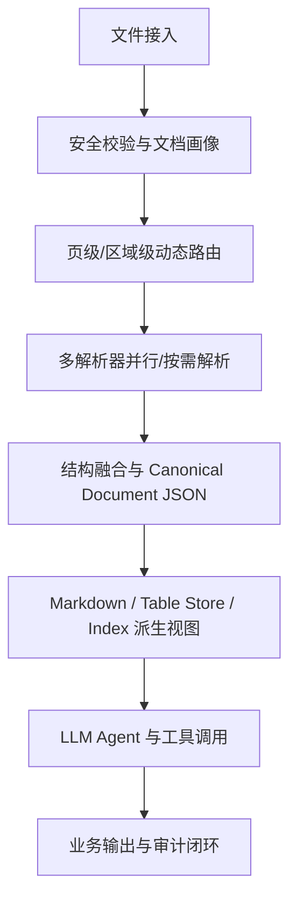
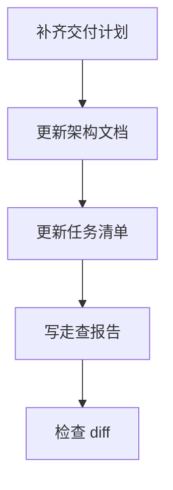

# 办公文档智能解析架构升级 — 实施计划

## 需求与决策

- 需求描述：根据前序背景讨论与业界最佳实践，更新办公文档智能解析系统的架构设计文档。
- 设计决策：将原“MarkItDown + PaddleOCR + Pandas + gpt-5.5”四层草案升级为生产级 Document AI Pipeline，突出页级/区域级路由、结构化中间表示、表格专用链路、置信度与人审闭环、可评测可溯源。
- 用户确认项：用户已确认需要采用更贴近业界最佳实践的架构方向，并要求更新架构文档。

## 架构 / 流程示意



## 系统现状分析

| # | 拦截点 / 现状 | 位置 | 条件 | 影响 |
|---|---------------|------|------|------|
| 1 | 架构文档以文档级双轨分流为主 | `.agents/tasks/260616_doc_parsing_arch/architecture_design.md` | 数字文档走 MarkItDown，扫描件走 OCR | 对混合 PDF、局部图片、跨页表格等复杂场景表达不足 |
| 2 | Markdown 被描述为主要流转产物 | 同上 | 解析后形成草稿/高纯度 Markdown | 不利于坐标、置信度、来源、引用溯源和人工复核 |
| 3 | PaddleOCR 被定位为轻量 OCR | 同上 | 扫描页和图片文字提取 | 未体现结构化文档解析、版面分析、表格结构识别能力 |
| 4 | 缺少生产闭环 | 同上 | LLM 推理直接生成输出 | 缺少置信度阈值、人审、评测集、审计、降级策略 |

## 改动清单

| # | 文件 | 操作 | 改动说明 |
|---|------|------|----------|
| 1 | `.agents/tasks/260616_doc_parsing_arch/implementation_plan.md` | NEW | 记录本次文档升级计划 |
| 2 | `.agents/tasks/260616_doc_parsing_arch/task.md` | NEW | 记录任务执行清单 |
| 3 | `.agents/tasks/260616_doc_parsing_arch/architecture_design.md` | MODIFY | 重写为生产级 Document AI Pipeline 架构 |
| 4 | `.agents/tasks/260616_doc_parsing_arch/walkthrough.md` | NEW | 完成后记录变更、验证和风险 |

## 精确改动内容

### 改动 1：升级架构理念

文件：`.agents/tasks/260616_doc_parsing_arch/architecture_design.md`

位置：全文

```diff
- 混合分流与 Agent 动态交互架构
+ 生产级 Document AI Pipeline：区域级动态路由、结构化中间表示、工具化推理闭环
```

### 改动 2：补充核心数据模型

文件：`.agents/tasks/260616_doc_parsing_arch/architecture_design.md`

位置：新增章节

```diff
+ Canonical Document JSON
+ DocumentBlock / TableBlock / FigureBlock / Provenance / Confidence
```

### 改动 3：补充落地策略

文件：`.agents/tasks/260616_doc_parsing_arch/architecture_design.md`

位置：新增章节

```diff
+ 路由策略、解析器选择、表格链路、RAG 切块、评测闭环、安全边界
```

## 前置确认步骤

- [x] 阅读项目背景文档。
- [x] 阅读原架构设计文档。
- [x] 阅读项目 AGENTS 规则与团队任务交付规范。
- [x] 明确本次只更新架构文档与任务交付记录，不修改应用代码。

## 红线约束

1. 不修改 `frontend/`、`crates/`、`scripts/` 等应用实现文件。
2. 不删除用户已有任务文档。
3. 不把 Markdown 继续描述为唯一主数据模型。
4. 架构方案必须保留成本控制、离线/本地化和 LLM 可消费性目标。

## 编码规范约束

- 本次适用规则：文档变更，不涉及 Controller、SQL、DTO、BigDecimal 等代码规则。
- SQL / XML 注意事项：不涉及。
- Java / 前端注意事项：不涉及。

## 数据库 / 菜单 / 权限

不涉及数据库、菜单或权限脚本。

## 质量保障

| 类型 | 命令 / 方法 | 预期 |
|------|-------------|------|
| 文档完整性 | 人工阅读 Markdown | 章节完整、结构清晰 |
| 变更检查 | `git diff -- .agents/tasks/260616_doc_parsing_arch` | 仅包含任务目录文档变更 |
| 代码验证 | 不运行 | 本次未改应用代码 |

## 回归测试清单

| 场景 | 类型 | 验证点 | 结果 |
|------|------|--------|------|
| 架构主线 | 正向 | 是否体现生产级 Document AI Pipeline | 通过 |
| 原目标保留 | 回归 | 是否保留 MarkItDown、PaddleOCR、Pandas、LLM 的定位 | 通过 |
| 复杂文档 | 边界 | 是否覆盖混合 PDF、复杂表格、低置信 OCR、跨页表格 | 通过 |

## 执行顺序



## 风险与回滚

- 风险：文档为架构建议，未经过样本文档基准测试，具体组件选择仍需后续 POC 验证。
- 回滚：如需恢复草案版，可通过 Git diff 或历史内容回退 `architecture_design.md`。
