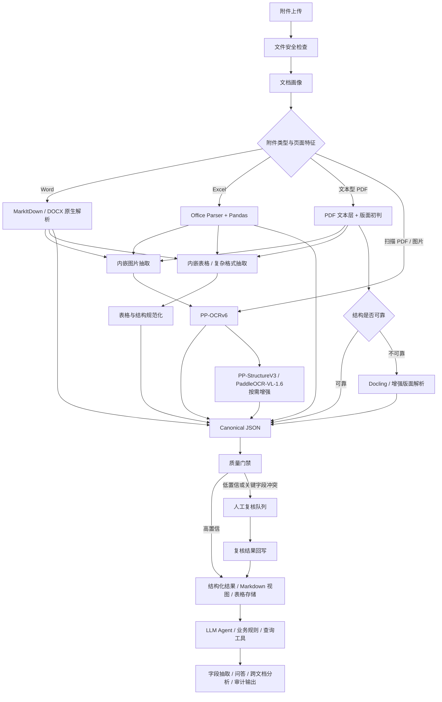
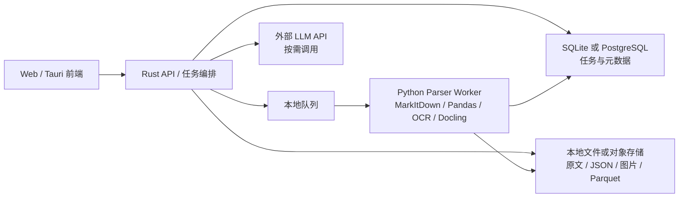
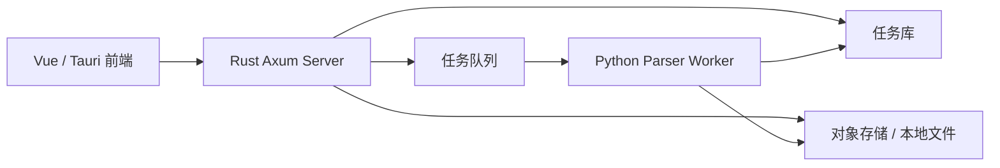

# 供应链附件解析系统 - 落地方案

## 1. 结论先行

针对供应链公司日常运营附件，推荐采用 **开源主链路 + 人工兜底 + 人工复核闭环** 的方案。

第一版不追求“所有工具全量上、所有文件全自动完美解析”，而是先把高频附件稳定跑通：

1. `Word / Excel / 文本型 PDF` 走轻量、确定性解析链路。
2. `图片 / 扫描 PDF` 走 OCR 链路。
3. `Word / PDF / Excel` 内嵌图片必须抽取为独立图片资产，再进入 OCR 或人工复核链路。
4. `Word / PDF / Excel` 内嵌表格、嵌套表格、合并单元格和复杂格式必须作为结构化对象抽取。
5. `复杂版面 / 低置信 / 高金额 / 关键字段冲突` 进入增强解析或人工复核。
6. `Canonical JSON` 作为唯一可信中间层。
7. `Markdown` 只作为 LLM 投喂视图，不作为系统事实来源。
8. 商业闭源 IDP 服务不纳入第一版；开源链路无法可靠处理时进入人工复核或人工录入。

这套方案的目标是 **生产可用、成本可控、结果可追溯、错误可复核、后续可持续优化**。

## 2. 适用范围

第一版覆盖附件类型：

| 类型 | 是否纳入第一版 | 主要处理目标 |
|------|----------------|--------------|
| PDF 文本型 | 是 | 提取文本、表格、字段、页码来源；处理多栏、文本框、表单、批注等复杂格式 |
| PDF 扫描型 | 是 | OCR 识别、字段抽取、低置信复核 |
| Excel | 是 | Sheet、表头、明细行、金额、数量、日期；抽取内嵌图片；处理合并单元格、隐藏行列、公式、透视表、图表 |
| Word | 是 | 合同、通知、说明、条款、表格；抽取内嵌图片；处理嵌套表格、文本框、页眉页脚、脚注、批注 |
| 图片 | 是 | 单据照片、截图、盖章件、物流凭证 |
| PPT | 暂不作为主目标 | 后续如确有业务场景再接入 |

供应链场景中优先支持的业务附件：

| 业务附件 | 重点字段 |
|----------|----------|
| 采购订单 / 销售订单 | 单号、客户/供应商、物料、数量、金额、交期 |
| 送货单 / 出入库单 | 单号、仓库、货品、数量、签收信息 |
| 对账单 | 往来单位、期间、明细、应收应付、差异 |
| 发票 / 付款凭证 | 发票号、金额、税额、付款日期、账户信息 |
| 合同 / 协议 | 合同主体、金额、期限、付款条款、违约条款 |
| 物流单据 / 图片凭证 | 运单号、车牌/箱号、签收、异常备注 |

## 3. 第一版工具选型

### 3.1 默认启用

| 能力 | 推荐工具 | 用法 |
|------|----------|------|
| Word / Office 转文本 | MarkItDown + Office 原生解析 | 生成结构初稿，保留段落、标题、表格 |
| Excel 解析 | Office Parser + Pandas | Sheet 解析、表头识别、数据类型规范化 |
| PDF 文本层 | PyMuPDF / pdfplumber / MarkItDown | 优先读取原生文本和坐标，避免无意义 OCR |
| 内嵌图片抽取 | Office / PDF 原生解析能力 | 从 Word、Excel、PDF 中抽取截图、盖章图、照片、扫描页片段 |
| 内嵌表格 / 复杂格式抽取 | Office / PDF 原生解析 + Table Parser | 抽取嵌套表格、合并单元格、文本框、批注、公式、隐藏行列、跨页表格 |
| 图片 / 扫描件 OCR | PaddleOCR `PP-OCRv6` CPU 版 | 图片、扫描 PDF 页面、拍照单据的文字检测与识别 |
| 表格处理 | Pandas + Parquet | 小中型表格清洗、字段映射、结果持久化 |
| 本地查询 | DuckDB | 需要跨表筛选、汇总、校验时使用 |
| 中间层 | Canonical JSON | 所有解析结果统一落到此结构 |
| LLM | 外部 API 或后续私有模型 | 只做推理、抽取校验、跨文档分析 |

### 3.2 按需启用

| 能力 | 推荐工具 | 触发条件 |
|------|----------|----------|
| 复杂 PDF 版面 | Docling | 文本层读取后结构混乱、表格/多栏/图文混排明显 |
| 视觉版面 / 表格结构 | PaddleOCR `PP-StructureV3` | 图片或扫描件中有表格、版面、单元格坐标、文本坐标等结构化需求 |
| 高复杂文档理解 | `PaddleOCR-VL-1.6` | 复杂图文混排、公式、印章、图表、复杂表格理解，需要 Markdown / JSON 结构化输出 |
| 复杂结构规范化 | Table Parser + Pandas / DuckDB | 内嵌表格、跨页表格、合并单元格、公式、隐藏行列、文本框等影响字段抽取 |
| 人工复核 / 人工录入 | 复核工作台 | 开源链路低置信、关键字段冲突、业务价值高 |
| VLM | 多模态大模型 | 可选辅助能力，不作为自动兜底；仅在明确批准时用于图表、照片、异常截图解释 |

### 3.3 第一版不默认启用

| 能力 | 原因 |
|------|------|
| 全量 GPU OCR | 成本和运维复杂度高，第一版 CPU 低并发即可 |
| 全量 Docling 跑所有 PDF | 性能和资源消耗不必要，应由路由触发 |
| 商业 IDP 接入 | 页数费用不可控，第一版不接入 |
| 本地大模型全量部署 | 对服务器要求高，第一版优先用外部 API 或轻量模型 |
| 大型向量数据库 | MVP 阶段可先用本地索引/轻量数据库，验证价值后再升级 |

## 4. 软件安装准备

本节只记录落地前需要安装或准备的运行环境。业务字段、样本集和主数据准备见后续实施路线。

### 4.1 必装项

| 项 | 类型 | 说明 |
|----|------|------|
| Python 3.10+ | 运行环境 | Parser Worker 的基础环境 |
| Python 虚拟环境 / uv | 环境管理 | 建议隔离依赖，避免污染系统 Python |
| `markitdown[all]` | Python 依赖 | Office / PDF / 图片等通用转换入口 |
| `docling` | Python 依赖 | 复杂 PDF、版面、表格结构增强解析 |
| `pymupdf` | Python 依赖 | PDF 文本层、页面、图片、坐标处理 |
| `pdfplumber` | Python 依赖 | PDF 表格和版面细粒度抽取 |
| `python-docx` | Python 依赖 | DOCX 原生结构解析 |
| `openpyxl` | Python 依赖 | XLSX / XLSM 原生结构解析 |
| `pandas` | Python 依赖 | 表格清洗、类型规范化、字段映射 |
| `duckdb` | Python 依赖 | 本地分析型 SQL、跨表查询、大表校验 |
| `pyarrow` | Python 依赖 | Parquet 读写 |
| `pillow` | Python 依赖 | 图片读取、裁剪、格式转换 |
| `opencv-python-headless` | Python 依赖 | 服务器端图片预处理，避免 GUI 依赖 |
| `paddleocr==3.7.0` | Python 依赖 / OCR 框架 | 锁定 PaddleOCR 3.7.0，默认使用 `PP-OCRv6` 做图片、扫描 PDF、内嵌图片 OCR |

推荐最小安装命令：

```bash
python -m pip install \
  "markitdown[all]" \
  docling \
  pymupdf \
  pdfplumber \
  python-docx \
  openpyxl \
  pandas \
  duckdb \
  pyarrow \
  pillow \
  opencv-python-headless \
  "paddleocr==3.7.0"
```

### 4.2 按需安装项

| 项 | 类型 | 什么时候需要 |
|----|------|--------------|
| `paddleocr[doc-parser]==3.7.0` | PaddleOCR 扩展 | 需要 `PP-StructureV3`、`PaddleOCR-VL-1.6`、版面、表格、印章、公式、图表等文档解析能力时 |
| 中文字体 | 系统资源 | 页面截图、PDF 渲染、人工复核预览出现中文缺字时 |
| LibreOffice headless | 系统软件 | 复杂 Office 文件原生解析失败，或需要先转 PDF 再解析时 |
| PostgreSQL | 数据库 | SQLite 无法满足多人并发、审计、生产元数据管理时 |
| Redis | 队列 / 缓存 | 本地队列不足，需要多个 worker 并发调度时 |
| MinIO / S3 | 对象存储 | 附件、页面截图、图片资产、Parquet 文件量变大时 |

### 4.3 暂不需要项

| 项 | 原因 |
|----|------|
| GPU / CUDA | 第一版用 CPU OCR，低并发即可 |
| Tesseract | 主链路使用 PaddleOCR，不使用 PyMuPDF 自带 OCR |
| 商业 IDP SDK | 第一版不接入商业 IDP，低置信走人工复核 |
| 大型向量数据库 | MVP 阶段先不引入，验证 RAG 价值后再决定 |
| 本地大模型推理服务 | 第一版优先外部 API 或规则 / 小模型，不部署本地大模型 |

### 4.4 注意事项

| 项 | 注意事项 |
|----|----------|
| OpenCV | 服务器使用 `opencv-python-headless`，不要同时安装 `opencv-python` 和 `opencv-python-headless` |
| PaddleOCR | 基线锁定 `paddleocr==3.7.0`；默认用 `PP-OCRv6`；需要视觉版面结构时启用 `PP-StructureV3`；需要高复杂文档理解时按需启用 `PaddleOCR-VL-1.6` |
| Docling | 首次运行可能下载或初始化模型，生产前应做模型预热和缓存目录规划 |
| DuckDB | 大表场景在系统配置里设置 `memory_limit`、`threads`、`temp_directory` |
| pdfplumber | 安装不用配置，但表格抽取策略需要按样本调参，例如线条策略、文本策略和容差参数 |
| openpyxl | 读取公式时要区分公式表达式和缓存值，缓存值取决于文件保存时是否已计算 |

## 5. 总体流程



## 6. 模块拆分

| 模块 | 职责 | 第一版建议 |
|------|------|------------|
| Ingestion Gateway | 上传、MIME 校验、Hash、原文归档 | 必做 |
| Document Profiler | 判断文件类型、页数、文本层、图片占比、是否扫描件 | 必做 |
| Router | 选择解析链路 | 必做，规则优先 |
| Office Parser Worker | 处理 Word、Excel | 必做 |
| PDF Parser Worker | 处理文本型 PDF | 必做 |
| Embedded Asset Extractor | 抽取 Word、Excel、PDF 内嵌图片并记录来源位置 | 必做 |
| Embedded Structure Extractor | 抽取 Word、Excel、PDF 内嵌表格和复杂格式并记录来源位置 | 必做 |
| Structure Normalizer | 标准化嵌套表格、合并单元格、隐藏行列、公式、文本框、批注、跨页表格 | 必做 |
| OCR Worker | 处理图片、扫描 PDF | 必做，但限制并发 |
| Layout Enhanced Worker | 复杂 PDF 增强解析 | 可延后或按需启用 |
| Canonical Builder | 统一 blocks、tables、fields、assets | 必做 |
| Quality Gate | 置信度、字段规则、金额/日期校验 | 必做 |
| Review Queue | 人工复核低置信字段 | MVP 可先做后台列表 |
| Markdown Projection | 从 Canonical JSON 生成 LLM 视图 | 必做 |
| Table Store | 表格转 Parquet / DuckDB 查询 | Excel 和大表场景必做 |
| LLM Agent | 抽取校验、跨文档分析、工具调用 | 第二阶段增强 |

## 7. 部署形态

### 7.1 MVP 单机部署

适合先跑样本、内部试用和中小量运营附件。



推荐资源：

| 用量阶段 | CPU / 内存 | GPU | 磁盘 | 说明 |
|----------|------------|-----|------|------|
| POC / 样本验证 | 4C / 8G | 不需要 | 100G | 少量文档、串行处理 |
| MVP 内部使用 | 4C / 16G | 不需要 | 300G 起 | 1 个 OCR worker + 1-2 个普通 worker |
| 中等业务量 | 8C / 32G | 可选 | 500G 起 | OCR 独立 worker，Docling 限流 |

第一版建议从 `4C / 16G / 无 GPU` 开始，OCR 并发控制为 1，普通解析并发控制为 2。等真实样本量和耗时数据出来后再扩容。

### 7.2 后续扩展部署

当附件量增长或 OCR 任务明显拖慢系统时，再拆分：

1. API 服务与解析 Worker 分离。
2. OCR Worker 单独部署，可横向扩容。
3. 文件存储迁移到对象存储。
4. 元数据从 SQLite 升级到 PostgreSQL。
5. 表格分析保留 DuckDB / Parquet，必要时再接数据仓库。
6. 人工复核队列独立出来，支持任务分派、复核记录、字段回写和质量统计。

## 8. Rust/Tauri 与 Python Worker 集成最佳实践

当前项目主体是 Rust + Axum + Vue + Tauri，没有 Python 目录是正常的。文档解析这类能力不建议强行塞进 Rust 进程里，推荐采用 **Rust 负责编排与产品能力，Python 负责文档解析 Worker** 的边界。

### 8.1 核心结论

| 问题 | 推荐决策 |
|------|----------|
| Python 是否嵌入 Rust 进程 | 不建议，第一版不要用 PyO3 嵌入解释器 |
| Python 是否要求用户自己安装 | 不建议，桌面端应随应用打包或按需安装到受控目录 |
| 服务端怎么部署 | Rust Server + Python Parser Worker 独立进程或容器 |
| 桌面端怎么部署 | Python Parser Worker 打成 Tauri sidecar |
| Rust 与 Python 怎么通信 | 通过强类型 JSON 请求 / 响应，必要时走 stdin/stdout、本地 HTTP 或任务队列 |
| 解析结果谁是边界 | `Canonical JSON`，Rust 只信任经过 schema 校验的解析结果 |
| 大模型是否参与打包 | 不参与，LLM 仍作为外部 API 或后续独立模型服务 |

### 8.2 当前项目模块分工

| 项目位置 | 职责 |
|----------|------|
| `crates/rust_tool_core` | 定义解析任务、路由决策、Canonical JSON schema、质量门禁、复核状态、错误类型 |
| `crates/rust_tool_server` | 提供上传 API、任务 API、解析任务编排、文件存储、调用 Python Worker |
| `crates/rust_tool_cli` | 提供命令行入口，后续可支持批量解析、样本评测、离线重跑 |
| `frontend` | 解析任务提交、进度展示、结果查看、人工复核页面 |
| `frontend/src-tauri` | 桌面端壳，负责把 Parser Worker 作为 sidecar 随应用分发 |
| `workers/document_parser_py` | 新增 Python Parser Worker，承载 MarkItDown、Docling、PaddleOCR、Pandas、DuckDB 等依赖 |

建议新增目录结构：

```text
workers/
  document_parser_py/
    pyproject.toml
    src/document_parser/
      __init__.py
      main.py
      api.py
      profiler.py
      router.py
      parsers/
      ocr/
      tables/
      canonical/
    tests/
    README.md
```

### 8.3 调用协议

Rust 不直接关心 MarkItDown、Docling、PaddleOCR 的内部参数细节，只负责把受控参数传给 Worker，并校验 Worker 返回结果。

推荐请求：

```json
{
  "task_id": "parse_001",
  "file": {
    "file_id": "file_001",
    "path": "/safe/workdir/file_001.pdf",
    "mime_type": "application/pdf",
    "sha256": "..."
  },
  "options": {
    "expected_doc_type": "delivery_note",
    "extract_embedded_images": true,
    "extract_embedded_tables": true,
    "extract_complex_structures": true,
    "ocr_enabled": true,
    "ocr_languages": ["ch", "en"],
    "max_pages": 50
  },
  "output": {
    "workdir": "/safe/workdir/parse_001",
    "canonical_json": "/safe/workdir/parse_001/canonical.json"
  }
}
```

推荐响应：

```json
{
  "task_id": "parse_001",
  "status": "succeeded",
  "canonical_json": "/safe/workdir/parse_001/canonical.json",
  "metrics": {
    "elapsed_ms": 12840,
    "page_count": 8,
    "ocr_page_count": 2
  },
  "warnings": [
    {
      "code": "LOW_OCR_CONFIDENCE",
      "message": "第 4 页 OCR 平均置信度低于阈值"
    }
  ]
}
```

### 8.4 服务端部署形态

服务端最佳实践是把 Python Worker 作为独立进程或容器部署：



第一版可以由 Rust Server 直接拉起受控的 Python Worker 子进程。进入多人并发和生产环境后，建议改成队列 + 独立 Worker：

1. Rust Server 只做上传、鉴权、任务创建、状态查询和结果读取。
2. Python Worker 只消费解析任务，产出 `canonical.json`、图片资产和 Parquet。
3. OCR / Docling / PaddleOCR-VL 这类高成本任务单独限流。
4. Worker 崩溃不影响 Rust API 进程。
5. Worker 版本、模型版本和解析参数写入任务审计记录。

### 8.5 桌面端打包形态

桌面端最佳实践是把 Python Worker 打成可执行文件，再作为 Tauri sidecar 随应用分发。

推荐方式：

1. 使用 PyInstaller / Nuitka 将 `workers/document_parser_py` 打包为 `document-parser` 可执行文件。
2. 按 Tauri 目标平台生成带 target triple 的 sidecar 文件。
3. 在 `frontend/src-tauri/tauri.conf.json` 的 `bundle.externalBin` 中声明 sidecar。
4. Rust/Tauri 侧通过受控命令启动 sidecar，并通过 JSON 协议通信。
5. 大模型和大体积 OCR 模型不要无脑塞进基础安装包，优先采用首次运行下载、企业离线资源包或管理员预置缓存。

示例目录：

```text
frontend/src-tauri/
  binaries/
    document-parser-aarch64-apple-darwin
    document-parser-x86_64-apple-darwin
    document-parser-x86_64-pc-windows-msvc.exe
    document-parser-x86_64-unknown-linux-gnu
```

示例配置方向：

```json
{
  "bundle": {
    "externalBin": [
      "binaries/document-parser"
    ]
  }
}
```

说明：实际文件名需要由构建脚本按目标平台补齐 target triple。当前项目已有 `./rt build-desktop`，后续实现时应在 Tauri 构建前增加“构建 Python sidecar”的步骤，而不是要求用户手动安装 Python。

### 8.6 打包与模型资源策略

| 资源 | 推荐策略 |
|------|----------|
| MarkItDown / pandas / openpyxl 等轻量依赖 | 可直接打入 Python Worker |
| PaddleOCR 基础 OCR | 可打入 Worker，但要评估安装包体积和首次初始化耗时 |
| Docling / PaddleOCR 文档解析扩展 | 按需打包或作为增强包，避免基础包过大 |
| OCR / 文档解析模型 | 优先放到受控缓存目录，支持首次下载、离线导入和版本校验 |
| LibreOffice headless | 服务端可安装系统依赖；桌面端不建议第一版内置，除非样本证明必须 |
| 临时文件 | 放到任务工作目录，任务结束后按保留策略清理 |

### 8.7 为什么不直接用 Rust 重写解析器

Rust 适合做安全边界、任务编排、API、状态机、文件存储和结果校验；但当前文档解析生态中，Office/PDF/OCR/表格处理的高成熟度工具主要集中在 Python。第一版用 Python Worker 可以更快形成生产闭环，同时保留 Rust 主体架构。

真正需要 Rust 化的部分是：

1. 上传安全、任务状态、权限和审计。
2. `Canonical JSON` 的强类型定义和校验。
3. 质量门禁、人工复核状态流转。
4. 文件与解析产物的生命周期管理。
5. 对外 API 和前端交互。

### 8.8 最终建议

第一版采用：

```text
RustTool 主体不改技术栈
+ 新增 Python Parser Worker
+ 服务端用独立进程 / 后续容器部署
+ 桌面端用 Tauri sidecar 打包
+ Rust/Python 之间只传 JSON 和文件引用
+ Canonical JSON 作为唯一可信交付物
```

这个方案兼顾当前项目结构、桌面打包、服务端部署、解析生态成熟度和后续可维护性，是当前 RustTool 做文档解析能力最稳妥的工程路线。

## 9. 路由规则

第一版路由尽量使用确定性规则，不让 LLM 决定底层解析路径。

| 输入特征 | 主链路 | 升级条件 |
|----------|--------|----------|
| `.docx` | MarkItDown + DOCX 原生结构 | 表格丢列、嵌套表格、图片内文字 |
| `.xlsx` | Office Parser + Pandas | 超大 Sheet、合并单元格复杂、跨 Sheet 对账 |
| PDF 有文本层且文本密度正常 | PDF text layer | 阅读顺序混乱、多栏、表格结构丢失 |
| Word / Excel / PDF 内嵌图片 | 图片资产抽取 + `PP-OCRv6` | 图片 OCR 低置信、截图/盖章/签收照片含关键字段 |
| Word / Excel / PDF 内嵌表格 | 结构抽取 + Table Parser + Pandas | 嵌套表格、合并单元格、跨页表格、表头缺失 |
| Word / Excel / PDF 复杂格式 | 结构抽取 + 结构规范化 | 文本框、页眉页脚、脚注、批注、公式、隐藏行列、透视表 |
| PDF 无文本层或图片占比高 | `PP-OCRv6` | 版面复杂、表格/坐标需求强时升级 `PP-StructureV3` |
| 图片 | `PP-OCRv6` | 图表、公式、印章、复杂理解需求时升级 `PaddleOCR-VL-1.6` 或人工复核 |
| 任意附件关键字段冲突 | 规则校验 + 人审 | 高金额、付款、合同主体等字段 |

关键字段触发复核建议：

| 字段类型 | 自动通过条件 | 进入复核条件 |
|----------|--------------|--------------|
| 单号 | 置信高且格式匹配 | 多个候选、格式异常 |
| 金额 | 原文、数值、币种一致 | 大小写不一致、合计不等于明细 |
| 日期 | 能标准化且上下文合理 | 多日期无法判断业务含义 |
| 客户/供应商 | 命中主数据或别名表 | 模糊匹配、多主体 |
| 数量 | 数值与单位明确 | 单位缺失、明细合计异常 |

## 10. 解析请求与参数控制

解析器参数应通过接口参数、文档模板配置和系统配置控制，LLM 不直接控制底层解析参数。

### 10.1 参数来源

| 参数类型 | 来源 | 示例 |
|----------|------|------|
| 任务级参数 | 接口传参 | 文件 ID、预期单据类型、是否 OCR、最大页数 |
| 文档模板参数 | 后台配置 | 送货单、对账单、合同等模板的字段 schema 和表格策略 |
| 解析器参数 | 接口参数 + 模板配置 | `pdfplumber table_settings`、OCR 语言、表格策略 |
| 系统资源参数 | 系统配置 | DuckDB memory limit、线程数、临时目录、worker 并发 |
| 复核参数 | 接口参数 + 业务配置 | 置信度阈值、高金额必审、关键字段必审 |

### 10.2 推荐解析请求

```json
{
  "file_id": "file_001",
  "expected_doc_type": "delivery_note",
  "parse_options": {
    "extract_embedded_images": true,
    "extract_embedded_tables": true,
    "extract_complex_structures": true,
    "ocr_enabled": true,
    "ocr_languages": ["ch", "en"],
    "max_pages": 50,
    "pdf_table_strategy": "lines",
    "preserve_formula_cells": true
  },
  "field_schema": [
    "delivery_no",
    "supplier_name",
    "material_code",
    "quantity",
    "amount"
  ],
  "review_policy": {
    "confidence_threshold": 0.85,
    "amount_must_review": true,
    "key_fields_must_have_source": true
  }
}
```

### 10.3 LLM 使用边界

| 环节 | 是否允许 LLM 决定 | 说明 |
|------|-------------------|------|
| 是否启用 OCR | 否 | 由文档画像、接口参数和路由规则决定 |
| OCR 语言、置信度阈值 | 否 | 由接口参数或模板配置决定 |
| `pdfplumber table_settings` | 否 | 由模板配置和重跑策略决定 |
| DuckDB 内存、线程、临时目录 | 否 | 由系统配置决定 |
| 字段解释、字段归类 | 是 | 基于 `Canonical JSON` 和字段 schema 推理 |
| 金额、日期、主体一致性校验 | 是 | 可调用工具校验并输出引用 |
| 解析失败原因说明 | 是 | LLM 可解释失败原因和建议重跑策略 |
| 触发真正重跑 | 否 | 由系统规则、人审操作或固定重跑策略触发 |

LLM 可以给出“疑似表格解析失败，建议使用文本策略重跑”之类的建议，但实际重跑必须由系统内置策略执行，并记录参数、版本和结果。

## 11. Canonical JSON 最小字段

第一版不需要一开始设计成大而全，但必须保留溯源能力。

```json
{
  "document_id": "sha256:...",
  "file": {
    "name": "delivery_note.pdf",
    "mime_type": "application/pdf",
    "hash": "...",
    "page_count": 3
  },
  "profile": {
    "document_type": "delivery_note",
    "is_scanned": false,
    "language": ["zh", "en"],
    "route": ["pdf_text", "table_parser", "embedded_image_ocr", "embedded_structure_extract"]
  },
  "blocks": [
    {
      "id": "blk_001",
      "page": 1,
      "type": "paragraph",
      "text": "送货单号：DN20260617001",
      "bbox": [72, 120, 420, 142],
      "confidence": 0.98,
      "engine": "pdf_text"
    }
  ],
  "tables": [
    {
      "id": "tbl_001",
      "page_start": 1,
      "page_end": 2,
      "source_container": "delivery_note.xlsx",
      "source_location": {
        "sheet": "Sheet1",
        "range": "A1:D30"
      },
      "complexity": {
        "has_merged_cells": true,
        "has_hidden_rows_or_columns": false,
        "has_formula_cells": true,
        "is_nested_table": false
      },
      "columns": ["物料编码", "品名", "数量", "单位"],
      "parquet_ref": "tables/tbl_001.parquet"
    }
  ],
  "assets": [
    {
      "id": "img_001",
      "type": "embedded_image",
      "source_container": "delivery_note.xlsx",
      "source_location": {
        "sheet": "Sheet1",
        "cell_anchor": "H12"
      },
      "file_ref": "assets/img_001.png",
      "ocr_block_ids": ["blk_021", "blk_022"],
      "needs_review": false
    }
  ],
  "fields": [
    {
      "name": "delivery_no",
      "value": "DN20260617001",
      "raw_text": "送货单号：DN20260617001",
      "confidence": 0.98,
      "source_block_ids": ["blk_001"],
      "needs_review": false
    }
  ],
  "quality": {
    "overall_confidence": 0.93,
    "needs_review": false,
    "warnings": []
  }
}
```

## 12. LLM Agent 使用边界

LLM Agent 不负责“看文件然后凭感觉输出结果”，而是基于工具和结构化上下文工作。

第一版 Agent 能力：

1. 根据 `Canonical JSON` 抽取业务字段。
2. 对字段做二次校验，例如金额合计、日期前后关系、客户名称一致性。
3. 生成可引用来源的摘要和问答。
4. 对跨文档问题调用表格查询工具，而不是直接吞大表。
5. 对低置信字段给出复核建议，但不直接强行改值。

禁止事项：

1. 不允许 LLM 覆盖原始解析值且不记录来源。
2. 不允许关键金额、付款账号、合同主体只依赖 LLM 判断。
3. 不允许把整份大 Excel 全量塞进上下文。
4. 不允许无引用地输出“已确认”“一定正确”等结论。
5. 不允许直接决定或修改 OCR、PDF 表格、DuckDB、图片预处理等底层解析参数。

## 13. 人工复核设计

人工复核不是失败兜底，而是生产级 IDP 的必要组成。

第一版复核页面可以很简单：

| 区域 | 内容 |
|------|------|
| 左侧 | 原文页面截图，高亮字段来源位置 |
| 右侧 | 字段名、候选值、置信度、规则告警 |
| 操作 | 通过、修改、标记无法识别、退回重跑 |
| 记录 | 复核人、复核时间、修改前后值、原因 |

进入复核的典型条件：

1. OCR 置信度低于阈值。
2. 金额、数量、日期字段解析冲突。
3. 合同主体、供应商、客户名称无法匹配主数据。
4. 高金额单据或付款相关字段。
5. 同一字段出现多个候选且无法用规则判断。

## 14. 评测集与验收指标

上线前必须准备一组真实脱敏样本，不能只靠单个演示文件判断方案效果。

建议样本集：

| 类型 | 数量建议 |
|------|----------|
| Word 合同/说明 | 20-50 份 |
| Excel 对账/明细 | 30-100 份 |
| 文本型 PDF 单据 | 50-100 份 |
| 扫描 PDF / 图片 | 50-100 份 |
| 异常样本 | 20-50 份 |

核心指标：

| 指标 | 目标 |
|------|------|
| 文件解析成功率 | 首版目标 95% 以上，不含损坏/加密文件 |
| 关键字段准确率 | 按字段统计，金额/单号/主体优先 |
| 表格结构准确率 | 表头、行数、列数、关键列值 |
| 自动通过率 | 初期不宜盲目追高，先控制误通过 |
| 人审命中率 | 进入人审的确实是风险样本 |
| 单页平均耗时 | 区分普通解析和 OCR 解析 |
| 成本 | 统计每 1000 页开源算力成本和人工复核人力成本 |

## 15. 实施路线

### 阶段 0：样本与字段定义

目标：明确到底要从附件里抽什么。

交付：

1. 附件类型清单。
2. 每类附件的目标字段。
3. 真实脱敏样本集。
4. 第一版字段字典和业务规则。

### 阶段 1：基础解析闭环

目标：Word、Excel、文本型 PDF 先稳定解析。

交付：

1. 文件上传与任务记录。
2. 文档画像与路由。
3. Office / PDF text 解析。
4. Word / Excel / PDF 内嵌图片抽取。
5. Word / Excel / PDF 内嵌表格和复杂格式抽取。
6. Canonical JSON。
7. Markdown Projection。
8. 解析结果查看。

### 阶段 2：OCR 与图片链路

目标：覆盖图片和扫描 PDF。

交付：

1. PaddleOCR worker：默认 `PP-OCRv6`，按需启用 `PP-StructureV3` / `PaddleOCR-VL-1.6`。
2. 图片预处理：旋转、裁剪、清晰度判断。
3. OCR block 写入 Canonical JSON。
4. 低置信字段标记。
5. 人工复核最小页面。

### 阶段 3：表格与供应链字段抽取

目标：把对账单、订单、送货单中的明细表变成可查询数据。

交付：

1. 表头识别。
2. 字段映射。
3. Parquet / DuckDB 表格存储。
4. 金额、数量、合计校验。
5. 主数据匹配：客户、供应商、物料。

### 阶段 4：LLM Agent 与跨文档分析

目标：在结构化结果基础上提供问答、校验和辅助分析。

交付：

1. 字段抽取 Agent。
2. 表格查询工具。
3. 原文引用工具。
4. 跨附件一致性检查。
5. 人工复核 / 人工录入兜底策略。

## 16. 第一版推荐决策

| 问题 | 决策 |
|------|------|
| 是否上商业 IDP | 否，第一版不接入，兜底改为人工复核 / 人工录入 |
| 是否需要 GPU | 第一版不需要 |
| 是否需要 Docling | 需要，但按需启用，不全量跑 |
| 是否需要 PaddleOCR | 需要，版本基线 `paddleocr==3.7.0`；默认 `PP-OCRv6`，复杂视觉文档按需启用 `PP-StructureV3` / `PaddleOCR-VL-1.6` |
| 是否需要 DuckDB | 建议引入，尤其 Excel/对账单多时 |
| 是否需要向量数据库 | 第一版非必须 |
| 是否需要人工复核 | 必须，哪怕第一版很简陋 |
| 是否让 LLM 直接解析所有附件 | 不建议 |
| 是否让 LLM 控制解析参数 | 否，解析参数走接口 / 配置 / 固定重跑策略 |
| Python 如何进入当前 Rust/Tauri 项目 | 新增 Python Parser Worker；服务端独立进程/容器，桌面端 Tauri sidecar |
| 是否要求客户机器安装 Python | 不建议，桌面端应随应用打包或走受控安装 |

## 17. 最小可交付版本

如果要最快做出可用版本，建议第一版只做这些：

1. 上传 PDF、Word、Excel、图片。
2. 自动判断文件类型和是否扫描件。
3. Word / Excel / 文本型 PDF 输出 Canonical JSON + Markdown。
4. Word / Excel / PDF 内嵌图片抽取为图片资产，并按需 OCR。
5. Word / Excel / PDF 内嵌表格、嵌套表格和复杂格式抽取为结构化对象。
6. 图片 / 扫描 PDF 输出 OCR 文本和置信度。
7. Excel 表格输出 Parquet，并可用 DuckDB 查询。
8. 抽取 10-20 个供应链核心字段。
9. 每个字段保留来源页、来源文本、置信度；图片字段还需保留图片资产来源；表格字段还需保留表格、行列和单元格来源。
10. 低置信字段进入人工复核。
11. 提供解析结果查看和下载 JSON。
12. 准备评测集，持续记录准确率。

这个版本已经具备生产级骨架。后面再逐步增强复杂 PDF、跨文档分析、人工复核工作台和可选视觉辅助能力。
