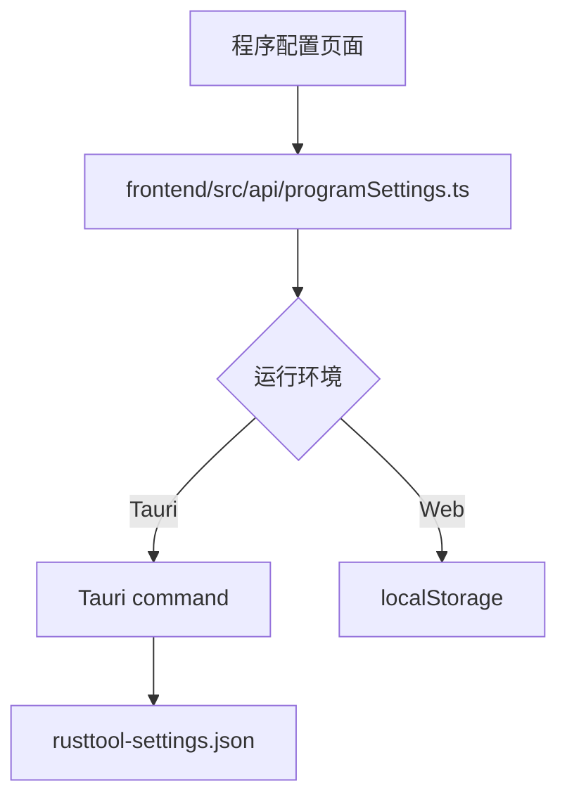
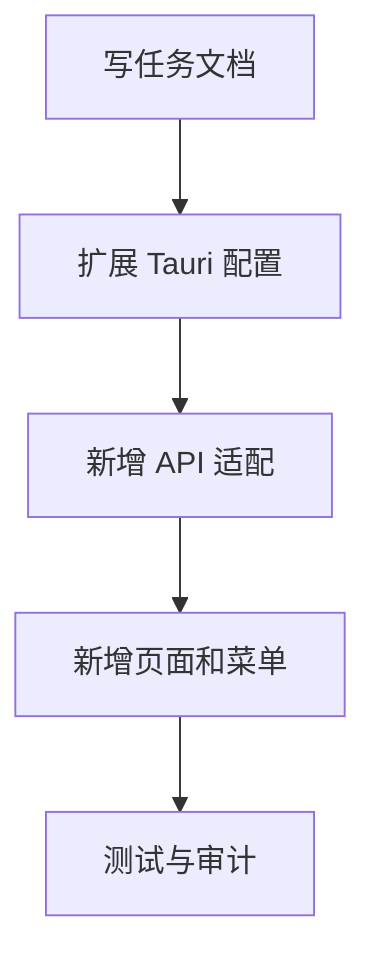

# 程序配置页 — 实施计划

## 需求与决策

- 需求描述：新增程序配置页面，第一期支持配置未来 SQLite 数据库文件存放位置。
- 设计决策：沿用现有 Ant Design Vue 页面风格；桌面端配置继续写入 `rusttool-settings.json`，Web 模式回退到 `localStorage`；不在本次引入 SQLite 依赖或真实建库。
- 用户确认项：用户已确认 SQLite 可配置存放位置，并希望系统中增加程序配置页面。

## 架构 / 流程示意



## 系统现状分析

| # | 拦截点 / 现状 | 位置 | 条件 | 影响 |
|---|---------------|------|------|------|
| 1 | 桌面配置集中写入 JSON | `frontend/src-tauri/src/lib.rs` | Tauri 运行 | 可复用现有配置文件，不需要先上数据库 |
| 2 | Web 模式使用 localStorage | `frontend/src/api/*.ts` | 非 Tauri 运行 | 新 API 需保持同样回退策略 |
| 3 | 左侧菜单由工具 Store 统一维护 | `frontend/src/stores/tools.ts` | 页面新增 | 需新增菜单项和路由 |

## 改动清单

| # | 文件 | 操作 | 改动说明 |
|---|------|------|----------|
| 1 | `frontend/src-tauri/src/lib.rs` | MODIFY | 增加程序配置结构、默认数据库路径和读写 command |
| 2 | `frontend/src/api/programSettings.ts` | NEW | 增加程序配置 API 适配层 |
| 3 | `frontend/src/pages/ProgramSettings.vue` | NEW | 新增程序配置页面 |
| 4 | `frontend/src/router/index.ts` | MODIFY | 注册程序配置路由 |
| 5 | `frontend/src/stores/tools.ts` | MODIFY | 左侧菜单新增程序配置入口 |
| 6 | `frontend/src/api/programSettings.test.ts` | NEW | 覆盖 Web fallback 配置读写 |

## 精确改动内容

### 改动 1：桌面配置结构扩展

文件：`frontend/src-tauri/src/lib.rs`

位置：`DesktopSettings` 附近

```diff
- struct DesktopSettings { vless_to_mihomo, osv_scanner }
+ struct DesktopSettings { vless_to_mihomo, osv_scanner, program }
```

### 改动 2：新增前端程序配置页

文件：`frontend/src/pages/ProgramSettings.vue`

位置：新增页面

```diff
+ 数据库存放位置输入
+ 选择目录 / 恢复默认 / 保存
```

## 前置确认步骤

- [x] 确认当前没有数据库依赖，本次只做配置入口。
- [x] 确认桌面端已有 JSON 配置文件可复用。
- [x] 确认 Web 模式需要 localStorage 回退。

## 红线约束

1. 不在本次引入 SQLite 真实连接，避免半成品数据库初始化影响现有功能。
2. 不迁移现有 OSV、VLESS、AgentSkills 数据。
3. 不改变现有导出文件、OSV 忽略规则和 Clash Party 外部配置读取逻辑。

## 编码规范约束

- 本次适用规则：`VUE-003` 请求/适配集中在 `api/`，`VUE-004` 配置字段保持唯一来源，`CLEAN-001` 避免遗留无用代码。
- SQL / XML 注意事项：本次不新增 SQL。
- Java / 前端注意事项：新增页面遵循现有 Vue + Ant Design Vue 结构，不绕过 API 适配层。

## 数据库 / 菜单 / 权限

- 数据库：不新增真实 SQLite 文件和 DDL。
- 菜单：左侧菜单新增“程序配置”。
- 权限：本地桌面工具暂无权限体系变更。

## 质量保障

| 类型 | 命令 / 方法 | 预期 |
|------|-------------|------|
| 代码检查 | `git diff --check` | 无输出 |
| 前端测试 | `pnpm --dir frontend test:run programSettings` | 通过 |
| 前端类型检查 / 构建 | `pnpm --dir frontend build` | 通过 |

## 回归测试清单

| 场景 | 类型 | 验证点 | 结果 |
|------|------|--------|------|
| 打开程序配置 | 正向 | 路由可访问，显示默认路径 | 待验证 |
| 保存自定义路径 | 正向 | 保存后再次加载保留配置 | 待验证 |
| 恢复默认 | 边界 | 清空自定义路径并显示默认路径 | 待验证 |
| 原有工具菜单 | 回归 | VLESS、OSV、AI 技能入口不受影响 | 待验证 |

## 执行顺序



## 风险与回滚

- 风险：本次只保存路径，不校验 SQLite 文件可写性；后续接 SQLite 初始化时需要补充目录创建、迁移和错误提示。
- 回滚：删除新增页面/API/command，并移除 `DesktopSettings.program` 字段即可恢复现状。
