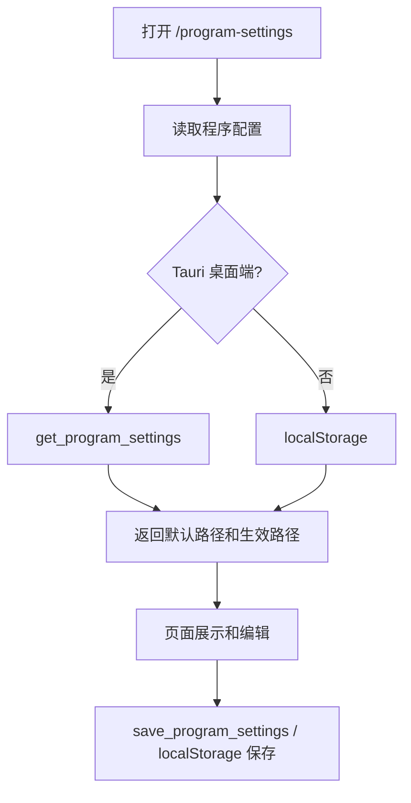

# 程序配置页 — 走查报告

## 变更概览

- 新增“程序配置”页面，用于配置未来 SQLite 数据库文件路径。
- 桌面端新增 `get_program_settings` / `save_program_settings` Tauri command，配置继续落在 `rusttool-settings.json`。
- Web 模式新增 `programSettings` API fallback，通过 `localStorage` 保存同名配置。
- 左侧菜单和工作台新增“程序配置”入口。

## 关键文件

- `frontend/src-tauri/src/lib.rs`：新增程序配置结构、默认数据库路径计算、读写 command。
- `frontend/src/api/programSettings.ts`：统一桌面端 / Web 端配置读写适配。
- `frontend/src/pages/ProgramSettings.vue`：新增配置页面。
- `frontend/src/router/index.ts`：新增 `/program-settings` 路由和 `/settings` 重定向。
- `frontend/src/stores/tools.ts`：新增左侧菜单项。
- `frontend/src/pages/ToolboxDashboard.vue`：新增工作台入口卡片。
- `frontend/src/api/programSettings.test.ts`：覆盖 Web fallback 的默认值、保存和异常恢复。

## 核心流程

## 验证结果

| 类型 | 命令 / 方法 | 结果 |
|------|-------------|------|
| 前端单测 | `pnpm --dir frontend test:run` | 通过，4 个文件 / 28 个测试 |
| 前端构建 | `pnpm --dir frontend build` | 通过；存在依赖 PURE 注释警告和 chunk size 提示 |
| Tauri 编译检查 | `cargo check -p rust_tool_desktop` | 通过 |
| Diff 检查 | `git diff --check` | 通过 |
| UI 验证 | in-app Browser 打开 `http://127.0.0.1:5173/program-settings` | 页面渲染、输入保存、状态同步通过 |

## 风险与注意事项

- 本次只保存数据库路径配置，不创建 SQLite 文件，不执行目录可写性校验。
- Web 模式默认路径为 `./data/rusttool.db`，桌面端默认路径由 Tauri `app_data_dir()/rusttool.db` 计算。
- 后续接入真实 SQLite 初始化时，需要将 `effectiveDatabasePath` 接到 storage 初始化逻辑，并补充迁移、备份、路径不可写错误提示。

## 待用户验证

- 桌面 App 中选择目录后，是否符合预期保存为 `<目录>/rusttool.db`。
- 后续 SQLite 接入时，是否需要提供“打开数据库目录 / 导出备份 / 迁移位置”三个操作。
