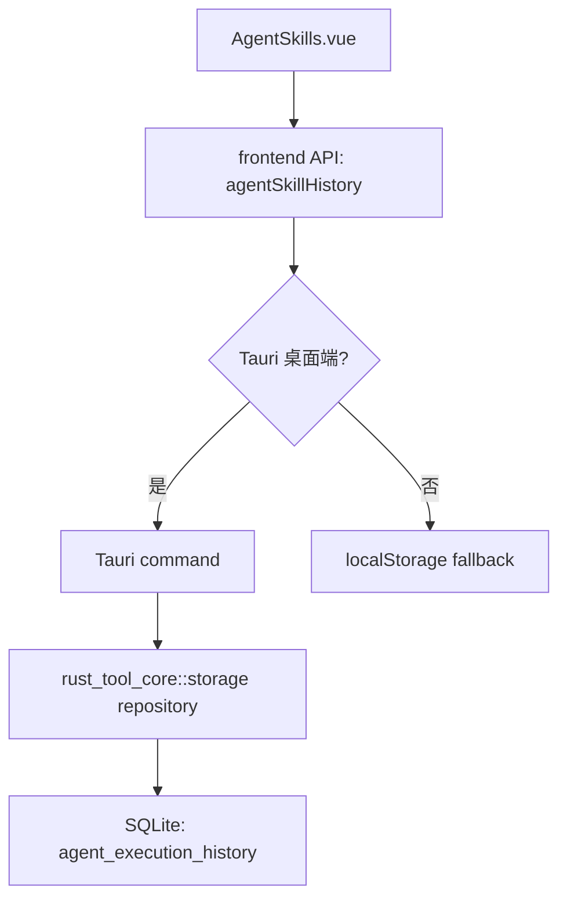
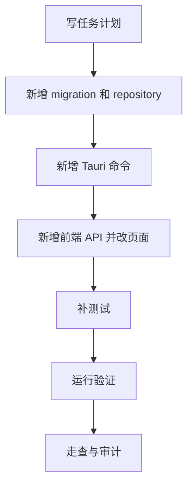

# AgentSkills 历史记录 SQLite 化 — 实施计划

## 需求与决策

- 需求描述：将 AI 技能页的执行历史从页面 `localStorage` 迁入可配置 SQLite 数据库，桌面端使用 SQLite，Web 模式继续使用 `localStorage` fallback。
- 设计决策：优先迁移 AgentSkills 执行历史，作为 SQLite 后续承载工具配置、扫描记录、导出记录的第一个真实业务入口。
- 用户确认项：用户已确认按“先迁移 AgentSkills 历史仓储”的建议开始实施。

## 架构 / 流程示意



## 系统现状分析

| # | 拦截点 / 现状 | 位置 | 条件 | 影响 |
|---|---------------|------|------|------|
| 1 | 执行历史在页面中直接 `localStorage.getItem/setItem` | `frontend/src/pages/AgentSkills.vue` | 页面加载、历史数组变化 | 桌面端不能共享 SQLite 配置，后续无法统一备份/清理 |
| 2 | 页面直接裁剪历史为 50 条 | `frontend/src/pages/AgentSkills.vue` | 每次执行脚本后 | 保留策略分散在页面，不利于后端统一治理 |
| 3 | SQLite 目前只有初始化和健康检查 | `crates/rust_tool_core/src/storage.rs` | 程序配置页检查数据库 | 已具备连接池和 migration 基础，可扩展 repository |
| 4 | Tauri 命令尚无 AgentSkills 历史接口 | `frontend/src-tauri/src/lib.rs` | 桌面端需要持久化历史 | 需要新增强类型命令和默认数据库路径接入 |

## 改动清单

| # | 文件 | 操作 | 改动说明 |
|---|------|------|----------|
| 1 | `crates/rust_tool_core/migrations/0002_agent_execution_history.sql` | NEW | 新增 AgentSkills 执行历史表、索引、schema version |
| 2 | `crates/rust_tool_core/src/storage.rs` | MODIFY | 增加历史记录 DTO、保存/查询/清空 repository 方法和测试 |
| 3 | `crates/rust_tool_core/src/lib.rs` | MODIFY | 导出历史记录 repository API |
| 4 | `frontend/src-tauri/src/lib.rs` | MODIFY | 增加桌面端查询、保存、清空 AgentSkills 历史命令 |
| 5 | `frontend/src/api/agentSkillHistory.ts` | NEW | 新增前端 API 适配层，桌面端走 Tauri，Web 走 localStorage |
| 6 | `frontend/src/api/agentSkillHistory.test.ts` | NEW | 覆盖 Web fallback 的查询、保存去重裁剪、清空逻辑 |
| 7 | `frontend/src/pages/AgentSkills.vue` | MODIFY | 移除页面直接 localStorage，调用 API 适配层 |
| 8 | `.agents/tasks/260619_agent_history_repository/*.md` | NEW/MODIFY | 任务交付、走查、审计、影响分析 |

## 精确改动内容

### 改动 1：新增 SQLite migration

文件：`crates/rust_tool_core/migrations/0002_agent_execution_history.sql`

位置：新增文件

```diff
+ CREATE TABLE IF NOT EXISTS agent_execution_history (...)
+ CREATE INDEX IF NOT EXISTS idx_agent_execution_history_script_created_at ...
+ PRAGMA user_version = 2;
```

### 改动 2：新增 Rust repository 方法

文件：`crates/rust_tool_core/src/storage.rs`

位置：`StorageDatabase` 和健康检查逻辑之后

```diff
+ pub struct AgentExecutionHistoryRecord { ... }
+ pub async fn save_agent_execution_history_record(...)
+ pub async fn list_agent_execution_history(...)
+ pub async fn clear_agent_execution_history(...)
```

### 改动 3：前端 API 层收口

文件：`frontend/src/api/agentSkillHistory.ts`

位置：新增文件

```diff
+ export async function listAgentSkillHistory(...)
+ export async function saveAgentSkillHistoryRecord(...)
+ export async function clearAgentSkillHistory()
```

## 前置确认步骤

- [x] 确认现有历史记录 key：`rusttool:codex:history`。
- [x] 确认当前保留策略：最多 50 条。
- [x] 确认 SQLite 基础层已存在并可通过程序配置路径初始化。

## 红线约束

1. 禁止在 SQL 中拼接用户输入，必须使用 `sqlx::query` bind 参数。
2. 禁止把前端 API 调用散落在页面中，新增调用必须收口到 `frontend/src/api/`。
3. 禁止重构无关工具、路由、已有 OSV/VLESS 配置存储。
4. 禁止破坏 Web 模式可用性，非 Tauri 环境必须继续 fallback。

## 编码规范约束

- 本次适用规则：`SEC-002`、`VALID-003`、`VUE-003`、`CLEAN-001`、`CLEAN-004`、`NAME-001`。
- SQL / XML 注意事项：本项目 Rust + sqlx，无 MyBatis XML；所有 SQLite 写入通过 bind 参数，索引覆盖脚本和时间查询。
- Java / 前端注意事项：无 Java Controller；Vue 页面不直接访问 Tauri/localStorage，统一经 API 模块。

## 数据库 / 菜单 / 权限

- 数据库：新增 `agent_execution_history` 表，记录脚本名称、参数、退出码、成功状态、stdout/stderr、创建时间。
- 菜单：不新增菜单。
- 权限：本地桌面工具，无服务端权限模型变更。

## 质量保障

| 类型 | 命令 / 方法 | 预期 |
|------|-------------|------|
| 代码检查 | `git diff --check` | 无输出 |
| Rust 测试 | `cargo test -p rust_tool_core storage` | 通过 |
| 桌面编译 | `cargo check -p rust_tool_desktop` | 通过 |
| 前端测试 | `pnpm --dir frontend test:run` | 通过 |
| 前端构建 | `pnpm --dir frontend build` | 通过 |
| UI 验证 | dev server + in-app Browser | AgentSkills 页面可打开，历史区域正常显示 |

## 回归测试清单

| 场景 | 类型 | 验证点 | 结果 |
|------|------|--------|------|
| 查询历史 | 正向 | 桌面端从 SQLite 读取，Web 从 localStorage 读取 | 待验证 |
| 保存历史 | 正向 | 同脚本同参数去重，新记录前置，最多 50 条 | 待验证 |
| 清空历史 | 正向 | 点击清空后持久层为空 | 待验证 |
| 无 Tauri 环境 | 回归 | Web fallback 不报错 | 待验证 |
| 数据库路径异常 | 边界 | Tauri 命令返回错误，页面提示 | 待验证 |

## 执行顺序



## 风险与回滚

- 风险：桌面端既有 `localStorage` 历史不会自动搬入 SQLite 时，用户可能看不到旧记录。
- 缓解：前端 API 首次查询桌面 SQLite 为空时，可导入旧 `localStorage` 历史再清理旧 key。
- 回滚：保留 Web fallback 逻辑；如 SQLite 仓储异常，可回退页面调用 localStorage API，不影响脚本执行主流程。
