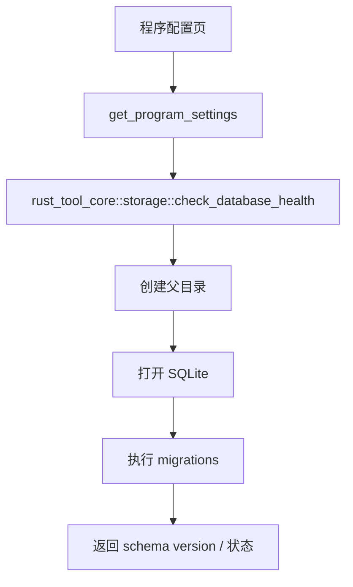
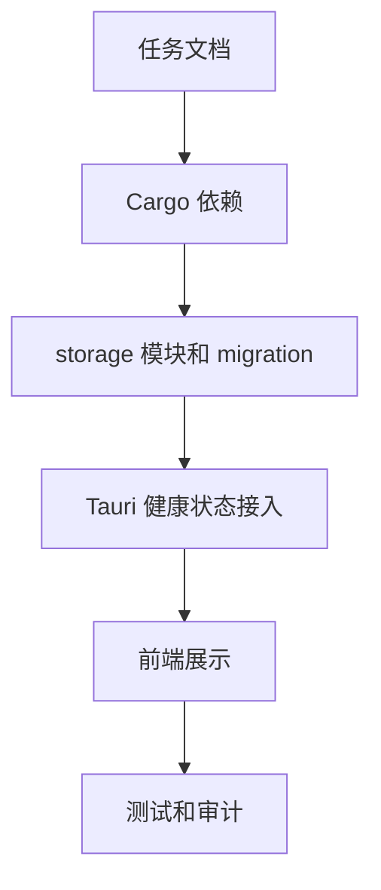

# SQLite storage foundation — 实施计划

## 需求与决策

- 需求描述：在已完成“程序配置页可配置数据库路径”的基础上，引入 SQLite 基础设施层，支持初始化、migration 和健康检查。
- 设计决策：使用 `sqlx + sqlite`；数据库路径仍由 `rusttool-settings.json` bootstrap；本次只建基础设施和基础表，不迁移 OSV / AgentSkills / VLESS 数据。
- 用户确认项：用户已同意按“SQLite storage foundation”开始实施。

## 架构 / 流程示意



## 系统现状分析

| # | 拦截点 / 现状 | 位置 | 条件 | 影响 |
|---|---------------|------|------|------|
| 1 | 程序配置页已提供数据库路径配置 | `frontend/src-tauri/src/lib.rs`, `ProgramSettings.vue` | 上一轮改动未提交 | 本次需在同一页面展示健康状态 |
| 2 | 当前没有 SQLite / sqlx 依赖 | `Cargo.toml` | 新增存储层 | 需更新 workspace 依赖 |
| 3 | core 是业务共享层 | `crates/rust_tool_core` | Web/Tauri/CLI 共用 | SQLite 初始化应放 core，避免 Tauri command 直接写 SQL |

## 改动清单

| # | 文件 | 操作 | 改动说明 |
|---|------|------|----------|
| 1 | `Cargo.toml` | MODIFY | 新增 `sqlx` workspace 依赖 |
| 2 | `crates/rust_tool_core/Cargo.toml` | MODIFY | 引入 `sqlx` |
| 3 | `crates/rust_tool_core/src/storage.rs` | NEW | SQLite 初始化、migration、健康检查 |
| 4 | `crates/rust_tool_core/src/lib.rs` | MODIFY | 导出 storage 类型和函数 |
| 5 | `crates/rust_tool_core/migrations/0001_storage_foundation.sql` | NEW | 建基础表和 metadata |
| 6 | `frontend/src-tauri/src/lib.rs` | MODIFY | 程序配置 response 增加数据库健康状态 |
| 7 | `frontend/src/api/programSettings.ts` | MODIFY | 前端类型增加健康状态 |
| 8 | `frontend/src/pages/ProgramSettings.vue` | MODIFY | 页面展示健康状态和 schema version |

## 精确改动内容

### 改动 1：新增 storage 模块

文件：`crates/rust_tool_core/src/storage.rs`

```diff
+ pub async fn check_database_health(path: impl AsRef<Path>) -> StorageHealth
+ async fn initialize_pool(path: &Path) -> Result<SqlitePool, StorageError>
+ static MIGRATOR = sqlx::migrate!("./migrations")
```

### 改动 2：程序配置页显示健康状态

文件：`frontend/src/pages/ProgramSettings.vue`

```diff
+ 数据库状态卡片
+ schema version / 文件是否存在 / 最近错误
```

## 前置确认步骤

- [x] 确认本次不迁移业务数据。
- [x] 确认数据库路径配置不放入 SQLite 自身。
- [x] 确认 SQLite 基础设施放入 `rust_tool_core`。

## 红线约束

1. 禁止在 Tauri command 或前端页面直接散落 SQL。
2. 禁止引入字符串拼接 SQL；所有运行期 SQL 使用 `sqlx::query` 静态语句。
3. 禁止迁移现有业务数据，避免扩大风险。

## 编码规范约束

- 本次适用规则：`ARCH-001` 分层边界，`SEC-002` SQL 参数化，`DB-001` 基础表主键，`VUE-003` API 适配集中。
- SQL / XML 注意事项：SQLite DDL 放 migration；无 MyBatis XML。
- 前端注意事项：页面只读取 API 返回的强类型状态，不直接计算数据库内部状态。

## 数据库 / 菜单 / 权限

- 数据库：新增基础 migrations。
- 菜单：不新增菜单，仅扩展已有程序配置页。
- 权限：本地工具无权限体系变更。

## 质量保障

| 类型 | 命令 / 方法 | 预期 |
|------|-------------|------|
| 代码检查 | `git diff --check` | 无输出 |
| Rust 测试 | `cargo test -p rust_tool_core storage` | 通过 |
| 桌面编译检查 | `cargo check -p rust_tool_desktop` | 通过 |
| 前端测试 | `pnpm --dir frontend test:run` | 通过 |
| 前端构建 | `pnpm --dir frontend build` | 通过 |

## 回归测试清单

| 场景 | 类型 | 验证点 | 结果 |
|------|------|--------|------|
| 默认路径健康检查 | 正向 | 能创建 DB 并返回 schema version | 待验证 |
| 自定义路径健康检查 | 正向 | 能创建父目录并初始化 | 待验证 |
| 空路径 | 边界 | 返回错误健康状态，不 panic | 待验证 |
| 程序配置页 | 回归 | 原路径保存功能仍可用 | 待验证 |

## 执行顺序



## 风险与回滚

- 风险：新增 `sqlx` 后首次构建可能需要下载依赖；如本地缓存缺失，需要用户允许网络访问。
- 风险：健康检查会创建数据库文件；本次仅在用户打开程序配置时针对生效路径执行。
- 回滚：移除 `sqlx` 依赖、storage 模块、migration 和健康状态展示即可退回路径配置版本。
