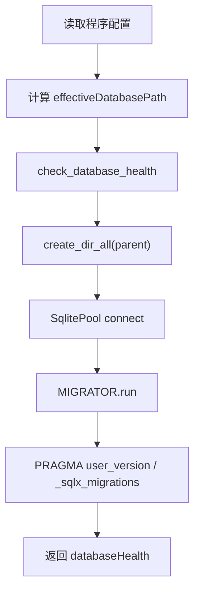

# SQLite storage foundation — 走查报告

## 变更概览

- 新增 `sqlx + sqlite` workspace 依赖，并更新 `Cargo.lock`。
- 新增 `rust_tool_core::storage` 模块，支持 SQLite 路径初始化、父目录创建、连接池创建、migration 执行和健康状态返回。
- 新增第一版 migration：基础 metadata、event、tool setting、export record 表。
- 程序配置页 response 增加 `databaseHealth`，桌面端会按生效路径检查并初始化 SQLite。
- 程序配置页增加数据库状态、schema version、迁移数量、文件/父目录状态展示。

## 关键文件

- `Cargo.toml`：新增 `sqlx` workspace 依赖。
- `crates/rust_tool_core/Cargo.toml`：core 引入 `sqlx`。
- `crates/rust_tool_core/src/storage.rs`：SQLite 初始化和健康检查核心逻辑。
- `crates/rust_tool_core/migrations/0001_storage_foundation.sql`：第一版基础表。
- `crates/rust_tool_core/src/lib.rs`：导出 storage API。
- `frontend/src-tauri/src/lib.rs`：程序配置 command 接入 `check_database_health`。
- `frontend/src/api/programSettings.ts`：前端类型增加 `DatabaseHealth`。
- `frontend/src/pages/ProgramSettings.vue`：展示数据库健康状态。

## 核心流程

## 验证结果

| 类型 | 命令 / 方法 | 结果 |
|------|-------------|------|
| Rust storage 测试 | `cargo test -p rust_tool_core storage` | 通过，3 个测试 |
| 桌面编译检查 | `cargo check -p rust_tool_desktop` | 通过 |
| 前端测试 | `pnpm --dir frontend test:run` | 通过，4 个文件 / 28 个测试 |
| 前端构建 | `pnpm --dir frontend build` | 通过；存在依赖 PURE 注释警告和 chunk size 提示 |
| Diff 检查 | `git diff --check` | 通过 |
| UI 验证 | in-app Browser 打开 `http://127.0.0.1:5173/program-settings` | 页面渲染、健康状态、schema、迁移数量显示通过 |

## 风险与注意事项

- 桌面端打开程序配置页时会对生效路径执行 SQLite 初始化；Web 模式不会初始化本地 SQLite。
- 本次只建基础表，不迁移 OSV、AgentSkills、VLESS 既有数据。
- `sqlx::migrate!` 会把 migrations 编译进 core，适合后续 Tauri 打包。
- 后续需要补充正式 Repository 和业务数据迁移策略。

## 待用户验证

- 在桌面 App 中打开“程序配置”，确认默认路径下会显示 `已就绪`、schema `1`、迁移数量 `1`。
- 使用自定义目录保存后，确认 `<目录>/rusttool.db` 能创建并显示健康状态。
