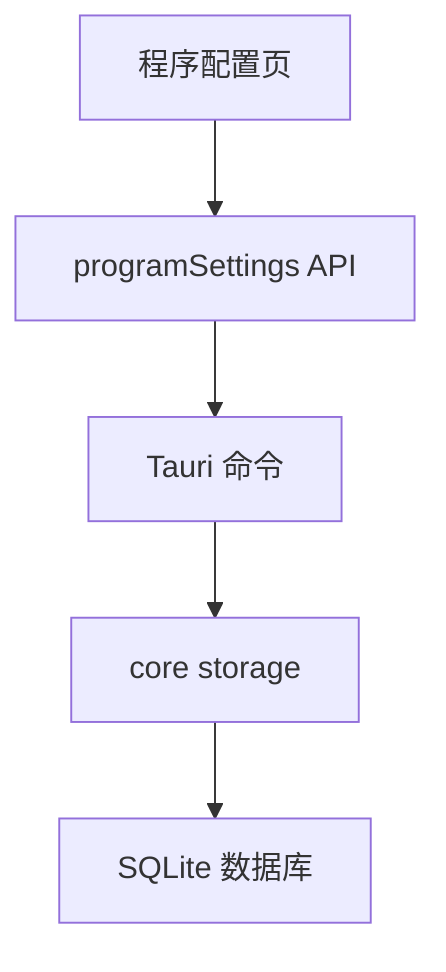
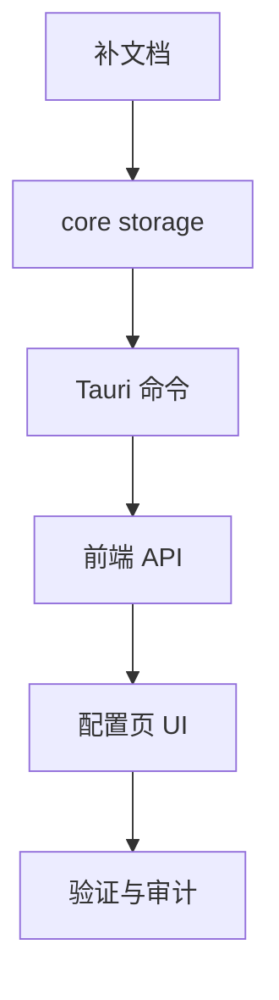

# 数据库维护能力 — 实施计划

## 需求与决策

- 需求描述：按上一步建议，在程序配置页面增加 SQLite 数据库维护能力。
- 设计决策：
  - 配置页展示数据库大小，包含主库、WAL、SHM 和合计大小。
  - 刷新状态复用现有 `get_program_settings`。
  - 备份使用 SQLite `VACUUM INTO` 生成一致性备份文件。
  - 打开目录由桌面端 Tauri 命令调用系统文件管理器。
  - 清理历史只清 Agent 执行历史和 OSV 命令历史，不清项目清单、不清最后一次完整扫描结果。
- 用户确认项：用户已确认执行下一步。

## 架构 / 流程示意

## 系统现状分析

| # | 拦截点 / 现状 | 位置 | 条件 | 影响 |
|---|---------------|------|------|------|
| 1 | 程序配置页已有路径和健康状态 | `frontend/src/pages/ProgramSettings.vue` | 当前只能保存/刷新路径 | 缺少维护动作 |
| 2 | SQLite health 已能初始化数据库 | `crates/rust_tool_core/src/storage.rs` | `check_database_health` 会运行迁移 | 可复用为刷新入口 |
| 3 | 历史数据分散在两张表 | `agent_execution_history`、`osv_command_history` | 已有 Agent 清理函数，OSV 还缺清理函数 | 需要统一维护命令 |

## 改动清单

| # | 文件 | 操作 | 改动说明 |
|---|------|------|----------|
| 1 | `crates/rust_tool_core/src/storage.rs` | MODIFY | 增加数据库文件统计、备份、OSV 命令历史清理 |
| 2 | `crates/rust_tool_core/src/lib.rs` | MODIFY | 导出新增 storage API |
| 3 | `frontend/src-tauri/src/lib.rs` | MODIFY | 增加备份、打开目录、清理历史 Tauri 命令 |
| 4 | `frontend/src/api/programSettings.ts` | MODIFY | 增加维护 API 与类型 |
| 5 | `frontend/src/pages/ProgramSettings.vue` | MODIFY | 增加维护 UI |
| 6 | `frontend/src/api/programSettings.test.ts` | MODIFY | 更新 Web fallback 测试 |

## 红线约束

1. 不删除 OSV 项目清单。
2. 不删除每个项目的最后一次完整扫描结果。
3. 不拼接用户输入 SQL；备份命令使用参数绑定。
4. 前端通过 API 模块调用，不在页面内直接散落 Tauri 命令。

## 编码规范约束

- 本次适用规则：`SEC-002`、`VALID-003`、`VUE-003`、`VUE-007`、`CLEAN-004`。
- SQL 注意事项：`VACUUM INTO` 使用参数绑定；清理历史使用固定 SQL。
- 前端注意事项：维护动作加 loading 防并发；危险动作弹确认。

## 数据库 / 菜单 / 权限

- 不新增表结构。
- 不新增菜单权限。
- 新增的清理操作只删除历史表数据。

## 质量保障

| 类型 | 命令 / 方法 | 预期 |
|------|-------------|------|
| Rust 测试 | `cargo test -p rust_tool_core storage` | 通过 |
| 桌面端检查 | `cargo check -p rust_tool_desktop` | 通过 |
| 前端测试 | `pnpm --dir frontend test:run` | 通过 |
| 前端构建 | `pnpm --dir frontend build` | 通过 |
| 代码检查 | `git diff --check` | 无输出 |

## 回归测试清单

| 场景 | 类型 | 验证点 | 结果 |
|------|------|--------|------|
| 刷新数据库状态 | 正向 | health 和大小刷新 | 待验证 |
| 备份数据库 | 正向 | 生成备份文件 | 待验证 |
| 打开目录 | 正向 | 桌面端可打开数据库所在目录 | 待验证 |
| 清理历史 | 边界 | 只清历史，不清项目/扫描结果 | 待验证 |
| Web 模式 | 回归 | 展示不可用，不误调用本地能力 | 待验证 |

## 执行顺序

## 风险与回滚

- 风险：备份路径已存在时 SQLite 会失败；实现中生成唯一备份路径。
- 风险：清理历史后数据库文件未必立即变小；可通过后续压缩/VACUUM 扩展解决。
- 回滚：移除新增 Tauri 命令和前端按钮，保留现有配置能力不受影响。
