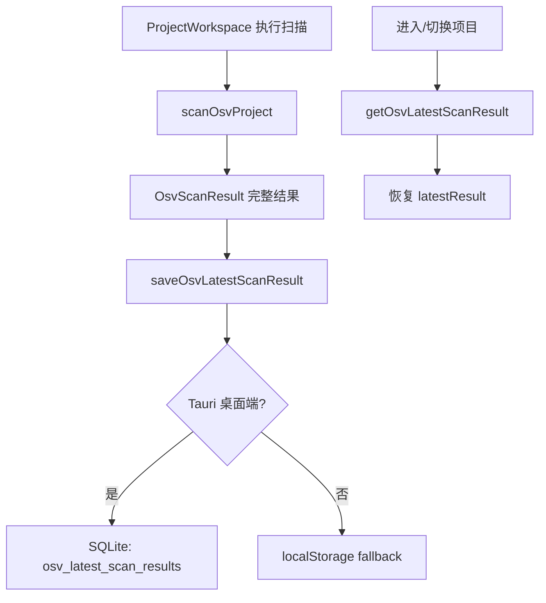
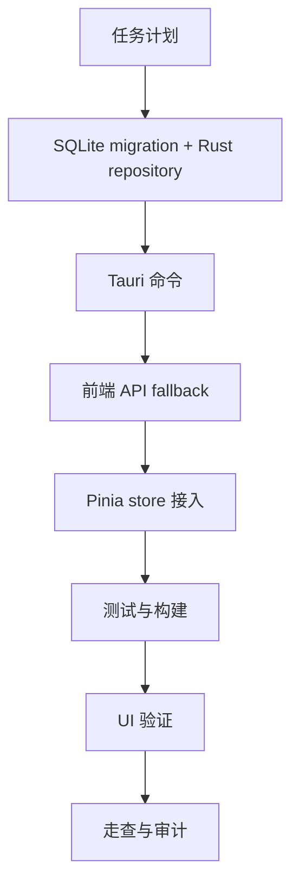

# OSV 最近完整扫描结果持久化 — 实施计划

## 需求与决策

- 需求描述：OSV Scanner 不应把扫描项目的完整数据当作 50 条历史日志截断；每个项目应保存最近一次完整扫描结果，页面刷新或重进项目后可恢复最后扫描状态。
- 设计决策：本次只把“每个项目最近一次完整扫描结果”迁入 SQLite；命令历史仍作为轻量操作历史保留 50 条；Web 模式继续使用 `localStorage` fallback。
- 用户确认项：用户已确认按“每个项目保存最近一次完整扫描结果 + 轻量命令历史”的模型开始实施。

## 架构 / 流程示意



## 系统现状分析

| # | 拦截点 / 现状 | 位置 | 条件 | 影响 |
|---|---------------|------|------|------|
| 1 | `latestResult` 只存在 Pinia 内存 | `frontend/src/stores/osvScanner.ts` | 页面刷新或重新进入 | 完整漏洞结果丢失 |
| 2 | 项目列表与命令历史存 JSON/localStorage | `frontend/src/api/osvScanner.ts` / Tauri settings | 保存配置时 | 只能恢复摘要和轻量历史 |
| 3 | 命令历史保留 50 条 | `frontend/src/stores/osvScanner.ts` / `frontend/src-tauri/src/lib.rs` | 保存设置时 | 适合操作日志，不适合扫描结果 |
| 4 | SQLite 已有初始化层和 AgentSkills 历史仓储 | `crates/rust_tool_core/src/storage.rs` | 程序配置路径有效 | 可扩展 OSV 结果仓储 |

## 改动清单

| # | 文件 | 操作 | 改动说明 |
|---|------|------|----------|
| 1 | `crates/rust_tool_core/migrations/0003_osv_latest_scan_results.sql` | NEW | 新增每项目最近完整扫描结果表 |
| 2 | `crates/rust_tool_core/src/storage.rs` | MODIFY | 新增保存/读取/删除 OSV 最近扫描结果 repository |
| 3 | `crates/rust_tool_core/src/lib.rs` | MODIFY | 导出 OSV 最近扫描结果仓储 API |
| 4 | `frontend/src-tauri/src/lib.rs` | MODIFY | 新增 Tauri 命令读写/删除项目最近扫描结果 |
| 5 | `frontend/src/api/osvScanner.ts` | MODIFY | 新增 `get/save/deleteOsvLatestScanResult`，Web fallback 使用 localStorage |
| 6 | `frontend/src/api/osvScanner.test.ts` | MODIFY | 覆盖 Web fallback 保存/读取/删除完整结果 |
| 7 | `frontend/src/stores/osvScanner.ts` | MODIFY | 加载/切换项目时恢复最近结果，扫描完成后保存完整结果，删除项目时删除结果 |
| 8 | `frontend/src/stores/osvScanner.test.ts` | MODIFY | 覆盖加载、切换和扫描后的持久化行为 |
| 9 | `.agents/tasks/260620_osv_latest_scan_storage/*.md` | NEW/MODIFY | 任务交付、影响分析、审计 |

## 精确改动内容

### 改动 1：新增 SQLite 表

文件：`crates/rust_tool_core/migrations/0003_osv_latest_scan_results.sql`

```diff
+ CREATE TABLE IF NOT EXISTS osv_latest_scan_results (
+   project_path TEXT PRIMARY KEY NOT NULL,
+   result_json TEXT NOT NULL,
+   scanned_at TEXT NOT NULL,
+   updated_at TEXT NOT NULL DEFAULT ...
+ );
+ PRAGMA user_version = 3;
```

### 改动 2：新增仓储函数

文件：`crates/rust_tool_core/src/storage.rs`

```diff
+ pub async fn save_osv_latest_scan_result(...)
+ pub async fn get_osv_latest_scan_result(...)
+ pub async fn delete_osv_latest_scan_result(...)
```

### 改动 3：前端恢复最近结果

文件：`frontend/src/stores/osvScanner.ts`

```diff
+ await restoreLatestScanResult(path)
+ await saveOsvLatestScanResult(result)
+ await deleteOsvLatestScanResult(path)
```

## 前置确认步骤

- [x] 确认 `OsvScanResult` 已包含漏洞列表、summary、command。
- [x] 确认当前 `latestResult` 页面刷新会丢失。
- [x] 确认命令历史 50 条只作为轻量操作历史，不替代完整扫描结果。

## 红线约束

1. 完整扫描结果不按 50 条命令历史截断。
2. SQL 动态值必须使用 `sqlx::query` bind 参数。
3. 前端持久化调用必须收口在 `frontend/src/api/osvScanner.ts`。
4. 不迁移或破坏 AgentSkills 历史逻辑。
5. 不一次性改造 OSV 页面视觉结构，避免扩大回归面。

## 编码规范约束

- 本次适用规则：`SEC-002`、`VALID-003`、`VUE-003`、`CLEAN-004`、`NAME-001`。
- SQL / XML 注意事项：Rust + sqlx，无 MyBatis XML；SQLite 写入使用参数绑定。
- Java / 前端注意事项：无 Java；Vue store 调用 API 层，不直接访问 Tauri。

## 数据库 / 菜单 / 权限

- 数据库：新增 `osv_latest_scan_results`，每个项目路径一条完整扫描结果。
- 菜单：不变。
- 权限：本地工具，不涉及服务端权限。

## 质量保障

| 类型 | 命令 / 方法 | 预期 |
|------|-------------|------|
| 代码检查 | `git diff --check` | 无输出 |
| Rust 测试 | `cargo test -p rust_tool_core storage` | 通过 |
| 桌面编译 | `cargo check -p rust_tool_desktop` | 通过 |
| 前端测试 | `pnpm --dir frontend test:run` | 通过 |
| 前端构建 | `pnpm --dir frontend build` | 通过 |
| UI 验证 | dev server + in-app Browser | OSV 页面可打开，项目切换/结果区域无前端错误 |

## 回归测试清单

| 场景 | 类型 | 验证点 | 结果 |
|------|------|--------|------|
| 扫描完成 | 正向 | 完整 `OsvScanResult` 保存到 SQLite/Web fallback | 待验证 |
| 重新进入项目 | 正向 | 恢复最近一次完整扫描结果 | 待验证 |
| 切换项目 | 回归 | 切换后恢复该项目自己的最近结果，不串项目 | 待验证 |
| 删除项目 | 回归 | 删除对应最近结果 | 待验证 |
| 无最近结果 | 边界 | 页面保持“暂无风险数据” | 待验证 |

## 执行顺序



## 风险与回滚

- 风险：完整扫描结果 JSON 可能较大，SQLite 文件体积随项目数增长。
- 缓解：每个项目只保留最近一次，不累积历史扫描快照。
- 回滚：保留原内存 `latestResult` 逻辑；如 SQLite 读取异常，页面可回到无结果状态，不影响重新扫描。
