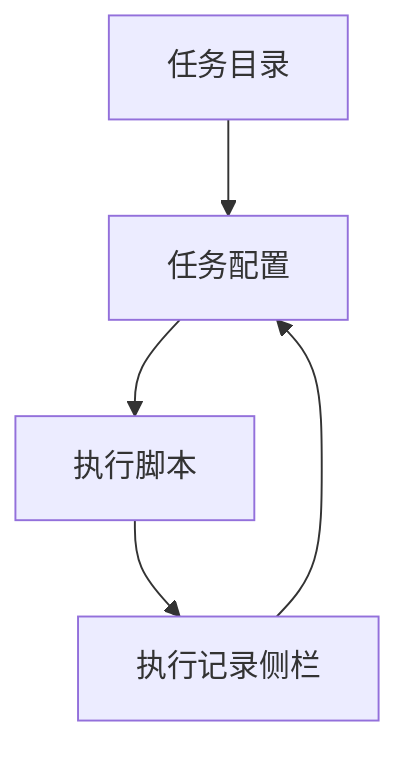
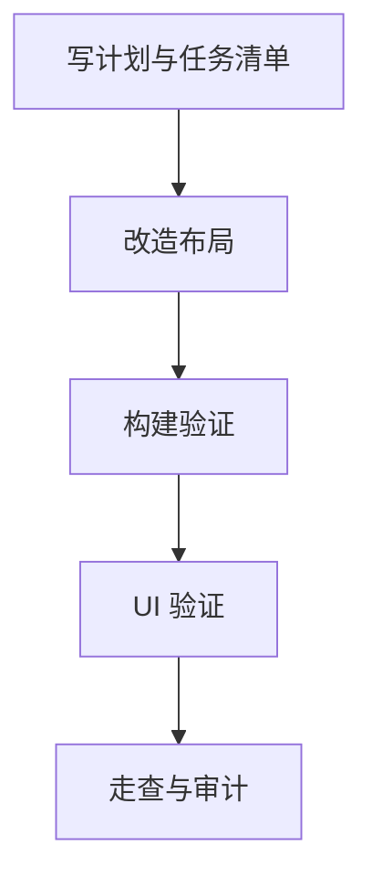

# AI 技能页面三栏布局 — 实施计划

## 需求与决策

- 需求描述：将 AI 技能页面底部的“执行记录”调整到独立第三列，减少操作时反复滚动。
- 设计决策：宽屏采用三栏布局：任务目录 / 任务配置 / 执行记录；中小屏保持响应式回落，避免内容挤压。
- 二次调优：根据截图反馈，目录列和配置列改为有上限的紧凑宽度，执行记录列优先获得剩余空间；长路径和日志允许在记录卡片内换行，避免页面横向滚动。
- 单技能默认选中：当脚本加载完成后实际可用技能只有 1 个时，自动选中该技能并直接显示配置区；多个技能时仍保持用户手动选择。
- 用户确认项：无阻塞确认项，按现有页面能力直接改造。

## 架构 / 流程示意



## 系统现状分析

| # | 拦截点 / 现状 | 位置 | 条件 | 影响 |
|---|---------------|------|------|------|
| 1 | 执行记录位于任务配置下方 | `frontend/src/pages/AgentSkills.vue` | 内容较高或窗口较宽时 | 操作历史需要滚到底部查看和复用 |
| 2 | 页面主容器固定最大宽度 1200px | `frontend/src/pages/AgentSkills.vue` | 桌面窗口较宽时 | 右侧空间没有充分利用 |
| 3 | 目录列和配置列比例偏大 | `frontend/src/pages/AgentSkills.vue` | 宽屏三栏时 | 执行记录列显示日志不够舒适 |
| 4 | 长路径 / 日志可能撑出横向滚动 | `frontend/src/pages/AgentSkills.vue` | 参数或输出存在长字符串时 | 页面底部出现横向滚动条 |
| 5 | 单技能仍需手动点击 | `frontend/src/pages/AgentSkills.vue` | 仅扫描到 1 个技能时 | 配置区停留空状态，多一次无意义操作 |

## 改动清单

| # | 文件 | 操作 | 改动说明 |
|---|------|------|----------|
| 1 | `frontend/src/pages/AgentSkills.vue` | MODIFY | 调整模板为三栏响应式布局，执行记录拆到独立列 |
| 2 | `.agents/tasks/260621_agent_skills_three_column_layout/*` | NEW | 记录计划、任务、走查和审计 |

## 精确改动内容

### 改动 1：三栏布局

文件：`frontend/src/pages/AgentSkills.vue`

位置：模板根布局附近

```diff
- <a-col :span="16">任务配置 + 执行记录</a-col>
+ <a-col>任务配置</a-col>
+ <a-col>执行记录</a-col>
```

## 前置确认步骤

- [x] 确认页面入口为 `frontend/src/pages/AgentSkills.vue`。
- [x] 确认本次不涉及后端接口、数据库、菜单权限。

## 红线约束

1. 禁止修改脚本执行、历史保存、清空历史等业务逻辑。
2. 禁止修改不相关后端/Rust 文件。
3. 禁止新增大面积硬编码主题色，尽量复用现有 Ant Design 组件和 token。

## 编码规范约束

- 本次适用规则：项目 `ARCH-002`、`CLEAN-002`、`VUE-001`、团队 `VUE`、`CLEAN`。
- SQL / XML 注意事项：不涉及。
- Java / 前端注意事项：保持 Vue 3 Composition API 现有写法，不拆出无必要抽象。

## 数据库 / 菜单 / 权限

不涉及。

## 质量保障

| 类型 | 命令 / 方法 | 预期 |
|------|-------------|------|
| 代码检查 | `git diff --check` | 无空白错误 |
| 编译 / 测试 | `pnpm --dir frontend run build` | 通过 |
| UI 验证 | 启动前端并检查页面布局 | 宽屏三栏，窄屏不重叠 |

## 回归测试清单

| 场景 | 类型 | 验证点 | 结果 |
|------|------|--------|------|
| 选中 AI 技能安装向导 | 正向 | 中栏显示配置，右栏显示执行记录 | 待验证 |
| 复用参数 | 回归 | 点击历史记录后配置区回到顶部并回填参数 | 待验证 |
| 无选中任务 | 边界 | 配置列提示先选任务，执行记录仍可查看 | 待验证 |

## 执行顺序



## 风险与回滚

- 风险：三栏在较窄窗口可能拥挤，需要断点回落。
- 回滚：还原 `frontend/src/pages/AgentSkills.vue` 模板布局即可。
