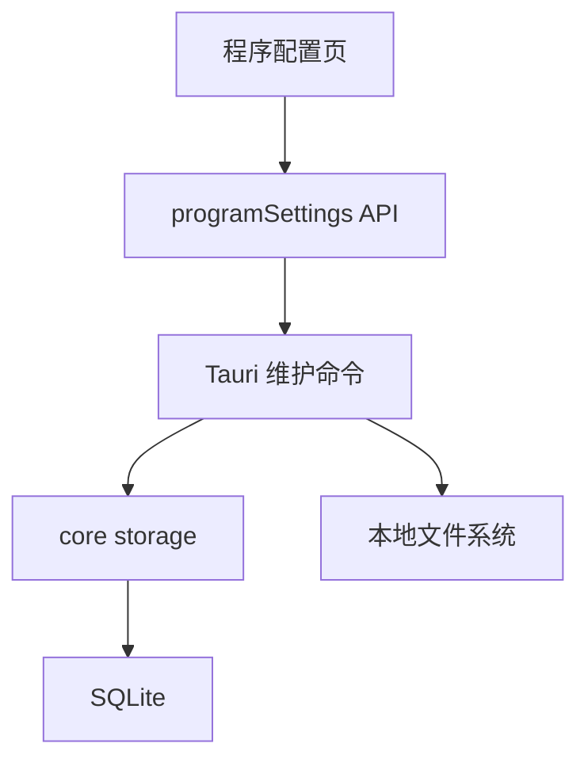
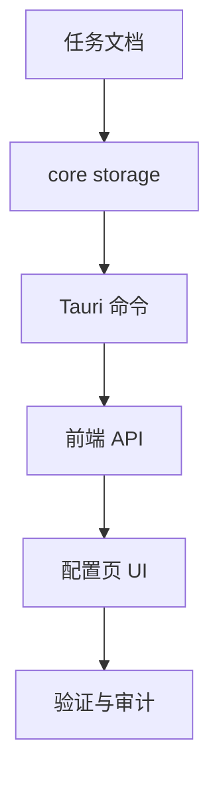

# 数据库压缩、恢复与诊断 — 实施计划

## 需求与决策

- 需求描述：
  - 旧库 `rusttool.sqlite` 不再支持迁移，提供删除清理。
  - 增加数据库压缩能力。
  - 增加从备份恢复能力。
  - 增加存储诊断，展示各类记录数量。
- 设计决策：
  - 旧库只清理 `rusttool.sqlite` 及其 `-wal` / `-shm` sidecar 文件，不做迁移。
  - 压缩使用 SQLite `VACUUM`，前后执行 WAL checkpoint。
  - 恢复前自动备份当前数据库，然后关闭连接、替换主库文件、清理 sidecar 并重新检查数据库。
  - 存储诊断展示记录数，不尝试估算单表文件大小。
- 用户确认项：用户确认旧库删除，并要求实施建议 2/3/4。

## 架构 / 流程示意

## 系统现状分析

| # | 拦截点 / 现状 | 位置 | 条件 | 影响 |
|---|---------------|------|------|------|
| 1 | 已有备份能力 | `storage.rs` / `frontend/src-tauri/src/lib.rs` | 只能备份，不能恢复 | 数据库安全闭环不完整 |
| 2 | 已有清理历史 | `clear_program_database_history` | 清理后 SQLite 文件可能不变小 | 需要压缩能力 |
| 3 | 发现旧库 `rusttool.sqlite` | 用户截图 | 当前新库是 `rusttool.db` | 需要显式删除旧库 |
| 4 | 配置页只展示文件大小 | `ProgramSettings.vue` | 不能判断增长来源 | 需要记录数诊断 |

## 改动清单

| # | 文件 | 操作 | 改动说明 |
|---|------|------|----------|
| 1 | `crates/rust_tool_core/src/storage.rs` | MODIFY | 增加 vacuum、诊断、恢复辅助 |
| 2 | `crates/rust_tool_core/src/lib.rs` | MODIFY | 导出新增 storage API |
| 3 | `frontend/src-tauri/src/lib.rs` | MODIFY | 增加压缩、恢复、旧库清理命令 |
| 4 | `frontend/src/api/programSettings.ts` | MODIFY | 增加维护 API 与类型 |
| 5 | `frontend/src/pages/ProgramSettings.vue` | MODIFY | 增加压缩、恢复、旧库清理和诊断 UI |
| 6 | `frontend/src/api/programSettings.test.ts` | MODIFY | 更新 Web fallback 测试 |

## 红线约束

1. 恢复前必须自动备份当前数据库。
2. 删除旧库只删除固定文件名 `rusttool.sqlite` 及 sidecar，不接受任意路径删除。
3. SQL 不拼接用户输入。
4. 恢复、压缩、删除旧库等危险动作必须有前端确认和 loading 防重入。

## 编码规范约束

- 本次适用规则：`SEC-002`、`VALID-003`、`VUE-003`、`VUE-007`、`CLEAN-004`。
- SQL 注意事项：诊断计数使用固定 SQL；VACUUM 不接收用户 SQL 片段。
- 前端注意事项：页面通过 `programSettings.ts` 调用，不直接散落 Tauri invoke。

## 数据库 / 菜单 / 权限

- 不新增表结构。
- 不新增菜单权限。
- 本次仅新增维护命令和 UI。

## 质量保障

| 类型 | 命令 / 方法 | 预期 |
|------|-------------|------|
| Rust 测试 | `cargo test -p rust_tool_core storage` | 通过 |
| 桌面端检查 | `cargo check -p rust_tool_desktop` | 通过 |
| 前端测试 | `pnpm --dir frontend test:run` | 通过 |
| 前端构建 | `pnpm --dir frontend build` | 通过 |
| 代码检查 | `git diff --check` | 无输出 |
| UI 验证 | Browser 打开程序配置页 | 无布局溢出和控制台错误 |

## 回归测试清单

| 场景 | 类型 | 验证点 | 结果 |
|------|------|--------|------|
| 压缩数据库 | 正向 | 成功返回最新状态 | 待验证 |
| 恢复备份 | 正向 | 恢复前自动备份当前库 | 待验证 |
| 删除旧库 | 边界 | 只删除固定旧库文件 | 待验证 |
| 存储诊断 | 正向 | 展示记录数 | 待验证 |
| Web 模式 | 回归 | 本地维护动作不可用 | 待验证 |

## 执行顺序

## 风险与回滚

- 风险：恢复数据库属于破坏性替换，必须依赖自动备份和用户确认。
- 风险：压缩期间数据库会有短时锁定，维护动作只在用户手动触发时执行。
- 回滚：移除新增命令和 UI，保留已有备份/清理历史能力。
