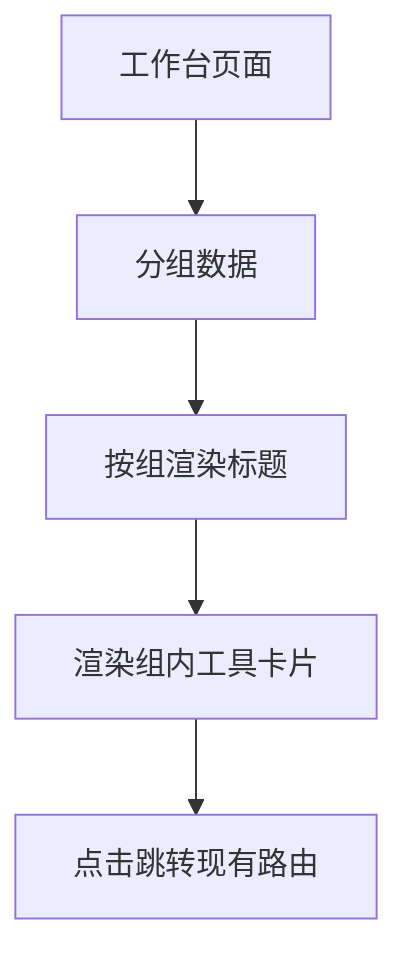
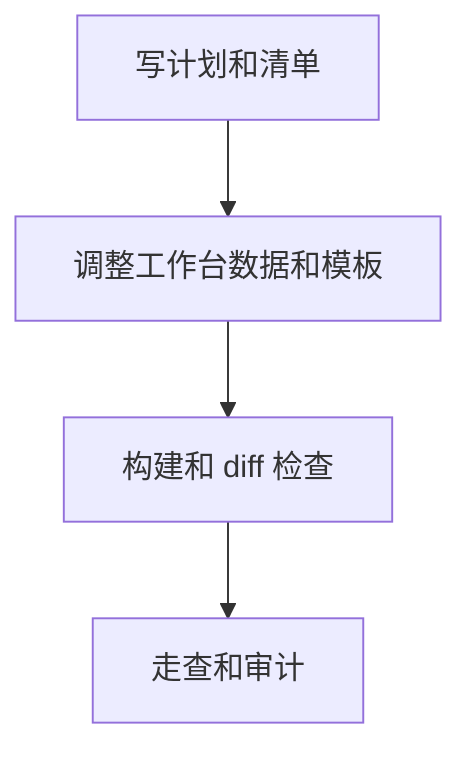

# 工作台分组展示 — 实施计划

## 需求与决策

- 需求描述：工作台工具入口需要按用途分组，降低四类工具混排带来的认知成本。
- 设计决策：采用“分区标题 + 简短说明 + 卡片网格”的轻量结构，保持现有 Ant Design 卡片与图标风格。
- 用户确认项：用户已确认按分组方式实施。

## 架构 / 流程示意



## 系统现状分析

| # | 拦截点 / 现状 | 位置 | 条件 | 影响 |
|---|---------------|------|------|------|
| 1 | 工作台使用单一 `apps` 数组渲染所有卡片 | `frontend/src/pages/ToolboxDashboard.vue` | 工具数量增长或类型混杂 | 用户需要自行判断工具类别 |
| 2 | 路由与侧栏已有工具定义 | `frontend/src/router/index.ts` / `frontend/src/stores/tools.ts` | 点击卡片进入功能页 | 本次不改路由与功能能力 |

## 改动清单

| # | 文件 | 操作 | 改动说明 |
|---|------|------|----------|
| 1 | `frontend/src/pages/ToolboxDashboard.vue` | MODIFY | 将工具入口数据按用途分组并更新模板结构 |
| 2 | `.agents/tasks/260622_dashboard_grouping/task.md` | NEW | 记录实施清单 |
| 3 | `.agents/tasks/260622_dashboard_grouping/walkthrough.md` | NEW | 完成后记录走查与验证 |
| 4 | `.agents/tasks/260622_dashboard_grouping/code_audit_report.md` | NEW | 完成后记录代码审计 |

## 精确改动内容

### 改动 1：工作台卡片分组

文件：`frontend/src/pages/ToolboxDashboard.vue`

位置：`apps` 数据定义和模板卡片渲染区域

```diff
- const apps = [...]
+ const appGroups = [{ title, description, apps: [...] }]

- <a-row v-for="app in apps">
+ <section v-for="group in appGroups">
+   <a-row v-for="app in group.apps">
```

## 前置确认步骤

- [x] 确认用户同意分组实施。
- [x] 确认本次只调整工作台展示结构，不修改路由、扫描、配置等业务逻辑。

## 红线约束

1. 禁止修改不相关后端逻辑、路由能力和工具执行行为。
2. 禁止引入新的运行依赖。
3. 禁止破坏现有卡片跳转路径。

## 编码规范约束

- 本次适用规则：`VUE-001`、`VUE-002`、`CLEAN-002`、`NAME-002`。
- SQL / XML 注意事项：不涉及。
- Java / 前端注意事项：沿用 Vue 3 `<script setup>` 与 Ant Design Vue 组件，不引入无价值抽象。

## 数据库 / 菜单 / 权限

不涉及数据库、菜单或权限变更。

## 质量保障

| 类型 | 命令 / 方法 | 预期 |
|------|-------------|------|
| 代码检查 | `git diff --check -- frontend/src/pages/ToolboxDashboard.vue` | 无输出 |
| 编译 / 测试 | `pnpm --dir frontend run build` | 通过 |
| UI 验证 | 本地浏览器验证，如工具可用 | 工作台显示分组且卡片可点击 |

## 回归测试清单

| 场景 | 类型 | 验证点 | 结果 |
|------|------|--------|------|
| 工作台分组展示 | 正向 | 三个分组标题与工具卡片显示正确 | 待验证 |
| 卡片跳转 | 回归 | 点击卡片仍进入原页面 | 待验证 |
| 窄屏布局 | 边界 | 卡片按 Ant Design 栅格自然换行 | 待验证 |

## 执行顺序



## 风险与回滚

- 风险：分组文案不符合最终产品命名偏好。
- 回滚：恢复 `ToolboxDashboard.vue` 原单数组渲染结构即可。
