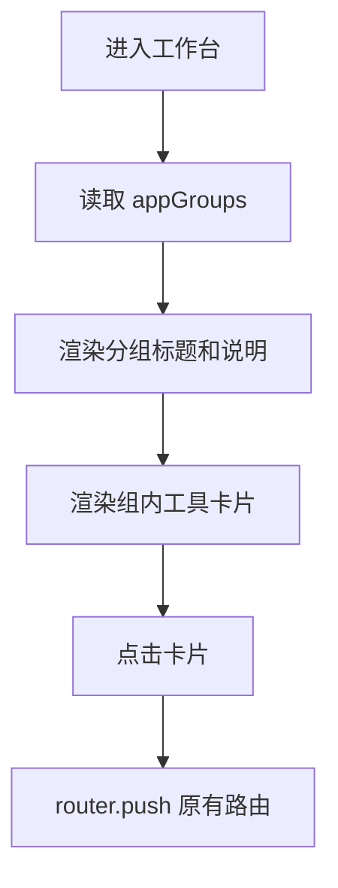

# 工作台分组展示 — 走查报告

## 变更概览

- 将工作台从单一工具卡片网格改为三组展示：开发与自动化、配置与运维、安全与审计。
- 保留现有工具卡片的 Ant Design Vue 风格、图标、说明和点击跳转能力。
- 将卡片圆角调整为 8px，贴合团队前端设计约束。

## 关键文件

- `frontend/src/pages/ToolboxDashboard.vue`
- `.agents/tasks/260622_dashboard_grouping/implementation_plan.md`
- `.agents/tasks/260622_dashboard_grouping/task.md`

## 核心流程

## 验证结果

| 验证项 | 结果 | 说明 |
|--------|------|------|
| `git diff --check -- frontend/src/pages/ToolboxDashboard.vue frontend/src/App.vue frontend/src/styles/base.css .agents/tasks/260622_dashboard_grouping` | 通过 | 无行尾空格或 diff 格式问题 |
| `pnpm --dir frontend run build` | 通过 | `vue-tsc -b` 与 `vite build` 通过 |
| 真实浏览器视觉验证 | 未完成 | 当前会话未暴露 in-app Browser 控制工具；按项目规则未使用 Chrome/Computer Use 绕行 |

构建过程中出现既有依赖警告和大 chunk 提示：

- `@vueuse/core` 中 `/* #__PURE__ */` 注释位置警告。
- `index-*.js` 超过 500 kB 的 Vite chunk size warning。

以上警告与本次工作台分组改动无直接关系。

## 风险与注意事项

- 分组命名属于产品文案层面，后续可按实际使用习惯微调。
- 未完成真实视觉验证，残余风险主要是分组间距在真实 Tauri 窗口中的观感需用户确认。

## 待用户验证

- 打开工作台确认三组展示是否符合预期。
- 点击四个工具卡片确认仍进入原页面。
