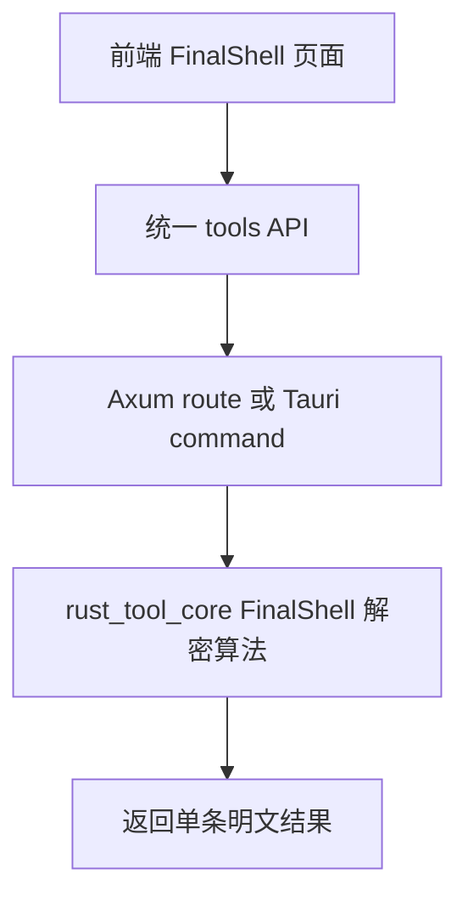
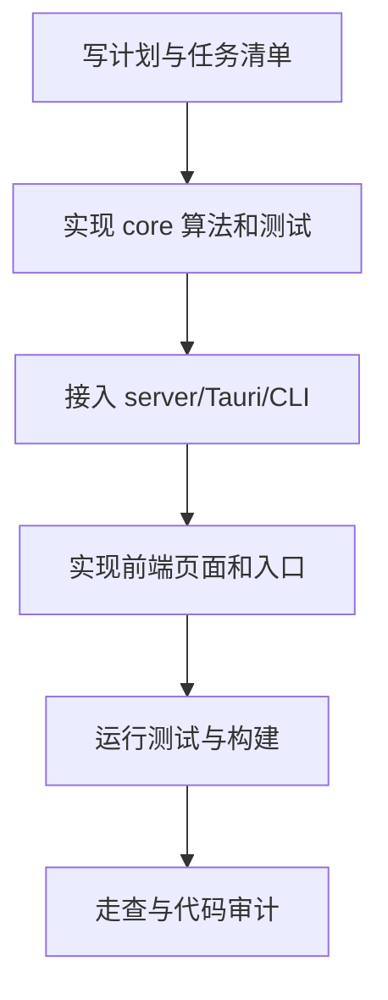

# FinalShell 密码解密工具 — 实施计划

## 需求与决策

- 需求描述：新增一个工具，用于输入 FinalShell 保存的加密密码字符串并解密得到明文。
- 设计决策：解密算法放在 `crates/rust_tool_core`，HTTP/Tauri/CLI 只做薄入口；前端新增独立页面并通过 `frontend/src/api/tools.ts` 统一适配 Web 与 Tauri。
- 用户确认项：本工具只在本机处理用户手动粘贴的密文，不自动读取 FinalShell 配置文件。

## 架构 / 流程示意



## 系统现状分析

| # | 拦截点 / 现状 | 位置 | 条件 | 影响 |
|---|---------------|------|------|------|
| 1 | 工具入口已有 VLESS 模式 | `crates/rust_tool_core/src/tools`、`crates/rust_tool_server/src/routes/tools.rs`、`frontend/src/api/tools.ts` | 新增工具应复用 | 保持桌面/Web 同源 |
| 2 | Tauri 命令集中注册 | `frontend/src-tauri/src/lib.rs` | 新增桌面能力需要注册 command | 桌面版才能调用 |
| 3 | 工作台卡片手动维护 | `frontend/src/pages/ToolboxDashboard.vue` | 新工具需要入口 | 用户可发现 |
| 4 | 敏感输入规范要求不落盘 | `AGENTS.md` | 解密得到明文密码 | 禁止日志与配置持久化 |

## 改动清单

| # | 文件 | 操作 | 改动说明 |
|---|------|------|----------|
| 1 | `crates/rust_tool_core/Cargo.toml` | MODIFY | 增加 Base64/MD5/OpenSSL 依赖 |
| 2 | `crates/rust_tool_core/src/tools/finalshell_password.rs` | NEW | 实现 FinalShell 解密算法和单元测试 |
| 3 | `crates/rust_tool_core/src/tools/mod.rs`、`crates/rust_tool_core/src/lib.rs` | MODIFY | 导出新工具能力 |
| 4 | `crates/rust_tool_server/src/routes/tools.rs`、`crates/rust_tool_server/src/app.rs` | MODIFY | 增加 HTTP API 与路由测试 |
| 5 | `frontend/src-tauri/src/lib.rs` | MODIFY | 增加 Tauri command |
| 6 | `crates/rust_tool_cli/src/main.rs` | MODIFY | 增加 CLI 子命令 |
| 7 | `frontend/src/api/tools.ts` | MODIFY | 增加统一前端 API |
| 8 | `frontend/src/pages/FinalShellPasswordDecoder.vue` | NEW | 新增解密页面 |
| 9 | `frontend/src/router/index.ts`、`frontend/src/pages/ToolboxDashboard.vue` | MODIFY | 增加页面路由和工作台入口 |

## 精确改动内容

### 改动 1：核心算法

文件：`crates/rust_tool_core/src/tools/finalshell_password.rs`

位置：新文件

```diff
+ pub fn decode_finalshell_password(input: &str) -> Result<String, FinalShellPasswordError>
+ Java Random 兼容实现 + MD5 派生 DES key + DES/ECB/PKCS5Padding 解密
```

### 改动 2：入口适配

文件：`crates/rust_tool_server/src/routes/tools.rs`、`frontend/src-tauri/src/lib.rs`

位置：工具入口区域

```diff
+ decode_finalshell_password(Json(request))
+ fn decode_finalshell_password_command(request)
```

### 改动 3：前端页面

文件：`frontend/src/pages/FinalShellPasswordDecoder.vue`

位置：新页面

```diff
+ 输入密文、触发解密、复制结果、清空结果
```

## 前置确认步骤

- [x] 确认核心逻辑必须位于 `rust_tool_core`。
- [x] 确认样例密文的 Java 输出：`Ben1993YYDSchina855!@#`。
- [x] 确认不自动持久化明文密码或输入内容。

## 红线约束

1. 禁止将明文密码写入日志、配置或数据库。
2. 禁止把解密结果写入错误消息。
3. 禁止在 Tauri/server 层复制核心业务算法。
4. 禁止前端绕开 `frontend/src/api/tools.ts` 直接散落 `fetch` 或 `invoke`。

## 编码规范约束

- 本次适用规则：`ARCH-001`、`ARCH-002`、`SEC-001`、`EX-001`、`CLEAN-001`、`NAME-001`。
- SQL / XML 注意事项：无数据库变更。
- Java / 前端注意事项：前端不持久化敏感字段；页面只保存运行期状态。

## 数据库 / 菜单 / 权限

- 无数据库脚本。
- 无菜单权限脚本。

## 质量保障

| 类型 | 命令 / 方法 | 预期 |
|------|-------------|------|
| 代码检查 | `git diff --check` | 无输出 |
| Rust 测试 | `cargo test` | 通过 |
| 前端构建 | `pnpm --dir frontend run build` | 通过 |
| 样例验证 | 样例密文解密 | 输出与 Java 样例一致 |

## 回归测试清单

| 场景 | 类型 | 验证点 | 结果 |
|------|------|--------|------|
| 样例密文 | 正向 | 解密为 Java 代码一致的明文 | 待验证 |
| 空输入 | 边界 | 返回明确错误 | 待验证 |
| 非 Base64 输入 | 边界 | 返回明确错误 | 待验证 |
| 过短密文 | 边界 | 返回明确错误 | 待验证 |
| VLESS 工具 | 回归 | 原工具编译与测试保持通过 | 待验证 |

## 执行顺序



## 风险与回滚

- 风险：OpenSSL DES legacy 算法在个别运行环境可能不可用；若验证失败，应改为纯 Rust DES 实现或引入稳定纯 Rust crate。
- 风险：解密结果属于敏感信息，用户复制或截图需自行控制环境。
- 回滚：移除新增模块、路由、命令、页面和依赖即可恢复。
