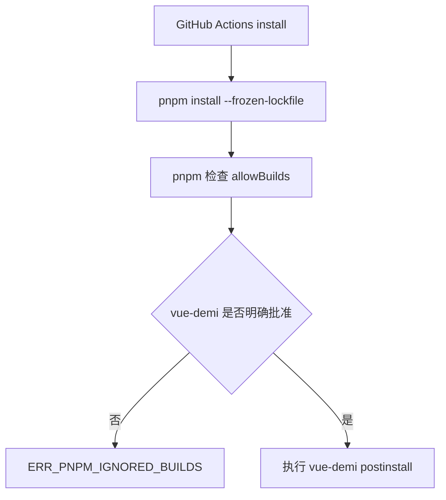

# GitHub Actions pnpm 构建脚本白名单修复 — 走查报告

## 变更概览

- 使用 GitHub 插件读取 run `27925003805` 的 job 和日志。
- 确认 `release (macos-latest)` 与 `release (windows-latest)` 均失败在 `Install frontend dependencies`。
- 失败原因是 pnpm 11 阻止未明确批准的 `vue-demi@0.14.10` 构建脚本。
- 将 `frontend/pnpm-workspace.yaml` 中 `vue-demi` 的占位值改为 `true`。

## 关键文件

- `frontend/pnpm-workspace.yaml`

## 核心流程

## 验证结果

| 验证项 | 结果 | 说明 |
|--------|------|------|
| GitHub Actions 日志读取 | 通过 | 两个平台均失败在 `Install frontend dependencies` |
| `pnpm --dir frontend install --frozen-lockfile` | 通过 | `vue-demi postinstall` 已执行，未再出现 `ERR_PNPM_IGNORED_BUILDS` |
| `pnpm --dir frontend run build` | 通过 | 前端构建通过 |
| `git diff --check -- frontend/pnpm-workspace.yaml .agents/tasks/260622_github_actions_pnpm_builds` | 通过 | 无 diff 格式问题 |

## 风险与注意事项

- 本次只修复依赖安装阶段。后续 Release job 继续运行后，可能暴露 Tauri 打包阶段的新问题。
- 本地 macOS Tauri DMG 打包曾复现 `hdiutil: create failed - 设备未配置`，但该问题不是本次 GitHub Actions 截图中的失败原因，因为远端 job 尚未进入打包步骤。

## 待用户验证

- 将 `frontend/pnpm-workspace.yaml` 修复提交到 GitHub 后，重新运行 Release Tauri App workflow。
