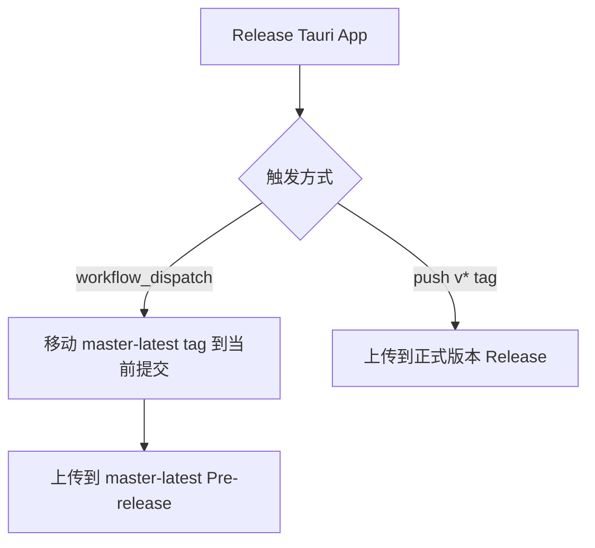
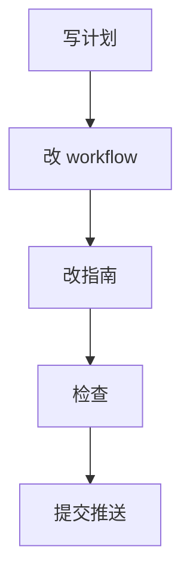

# master-latest Release 策略修复 — 实施计划

## 需求与决策

- 需求描述：手动从 `master` 分支打包时，产物不应上传到固定版本 `v0.1.0` Release，避免源码 tag 与二进制产物不一致。
- 设计决策：保留正式 `v*` tag 发布；新增 `workflow_dispatch` 手动打包发布到 `master-latest` 预发布 Release。
- 用户确认项：用户同意由我直接处理。

## 架构 / 流程示意



## 系统现状分析

| # | 拦截点 / 现状 | 位置 | 条件 | 影响 |
|---|---------------|------|------|------|
| 1 | 手动触发也使用 `tagName: v__VERSION__` | `.github/workflows/publish.yml` | `workflow_dispatch` | master 产物上传到 `v0.1.0` Release |
| 2 | GitHub Release 必须绑定 tag | GitHub Release 机制 | Release 展示源码 zip | 源码 zip 取自 tag，而不是手动打包分支 |

## 改动清单

| # | 文件 | 操作 | 改动说明 |
|---|------|------|----------|
| 1 | `.github/workflows/publish.yml` | MODIFY | 手动触发改发 `master-latest`，正式 tag 触发仍发版本 Release |
| 2 | `github_ops_guide.md` | MODIFY | 更新网页端操作说明，区分预览包和正式包 |

## 精确改动内容

### 改动 1：拆分手动预览发布和正式版本发布

文件：`.github/workflows/publish.yml`

```diff
- tagName: v__VERSION__
+ workflow_dispatch: tagName master-latest
+ push tags v*: tagName ${{ github.ref_name }}
```

## 前置确认步骤

- [x] 确认当前问题是 Release tag 与构建来源错位。
- [x] 确认 GitHub Release 必须绑定 tag，无法直接绑定 branch。

## 红线约束

1. 不修改 Tauri 应用版本号。
2. 不把正式版本 Release 当作 master 测试包归档。
3. 不混入当前工作区中不相关 Rust 改动。

## 编码规范约束

- 本次适用规则：配置变更保持最小化，文档同步更新。
- SQL / XML 注意事项：不涉及。
- Java / 前端注意事项：不涉及前端代码运行逻辑。

## 数据库 / 菜单 / 权限

不涉及数据库、菜单或权限变更。

## 质量保障

| 类型 | 命令 / 方法 | 预期 |
|------|-------------|------|
| YAML 检查 | 目视检查 workflow 结构 | 条件分支清晰 |
| 代码检查 | `git diff --check -- .github/workflows/publish.yml github_ops_guide.md .agents/tasks/260622_master_latest_release` | 无输出 |
| 远程验证 | 推送后手动触发 workflow | 产物上传到 `master-latest` |

## 回归测试清单

| 场景 | 类型 | 验证点 | 结果 |
|------|------|--------|------|
| 手动触发 | 正向 | 创建/更新 `master-latest` 预发布 Release | 待验证 |
| `v*` tag 触发 | 回归 | 仍创建正式版本 Release | 待验证 |

## 执行顺序



## 风险与回滚

- 风险：`master-latest` 作为移动 tag，历史源码 zip 会随最新 master 改变，不适合作为正式版本。
- 回滚：恢复 `.github/workflows/publish.yml` 原 `v__VERSION__` 逻辑。
