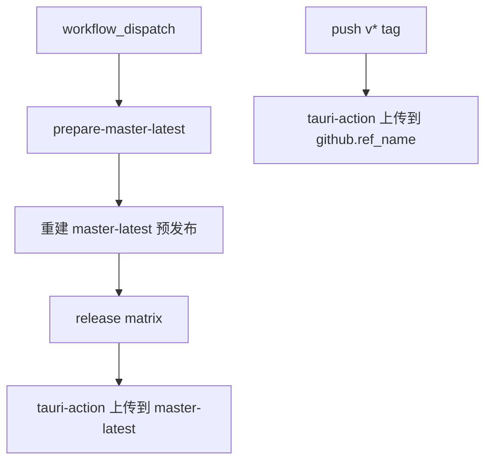

# master-latest Release 策略修复 — 走查报告

## 变更概览

- 手动触发 `workflow_dispatch` 时，先将 `master-latest` tag 强制移动到当前构建提交。
- 手动触发时先重建 `RustTool master-latest` 预发布 Release，再上传构建产物。
- `v*` tag 触发构建仍上传到对应正式版本 Release。
- 更新 `github_ops_guide.md`，说明手动预览包和正式版本包的区别。

## 关键文件

- `.github/workflows/publish.yml`
- `github_ops_guide.md`

## 核心流程

## 验证结果

| 验证项 | 结果 | 说明 |
|--------|------|------|
| `git diff --check -- .github/workflows/publish.yml github_ops_guide.md .agents/tasks/260622_master_latest_release` | 通过 | 无 diff 格式问题 |
| 目视 workflow 条件检查 | 通过 | `workflow_dispatch` 与 `push` 两条路径互斥 |
| 提交并推送 | 通过 | 已推送 `9f2a650`、`4c95f99`、`3e50641` 到 `origin/master` |
| 远程 Actions 验证 | 通过 | `Release Tauri App #5` 全部 job 成功 |
| Release 页面验证 | 通过 | `master-latest` 显示 `Commit 3e50641`，Assets 6 个 |

## 风险与注意事项

- `master-latest` 是移动 tag，适合预览包，不适合作为正式版本归档。
- 已上传到 `v0.1.0` 的 master 构建资产不会被本次 workflow 修改自动删除；如需保持 `v0.1.0` 干净，需要在 Release 页面手动删除错放的资产，或重新发布正确的 `v0.1.0`。
- 正式版本仍建议通过新的 `v*` tag 触发，例如 `v0.1.1`。

## 待用户验证

- 打开 `master-latest` Release，下载需要的平台安装包进行安装验证。
- 如需保持 `v0.1.0` 正式 Release 干净，手动删除之前错放在 `v0.1.0` 下的 master 构建资产。
