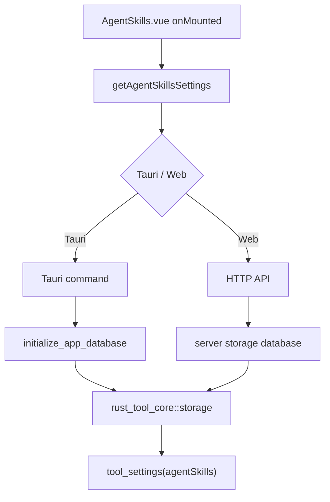
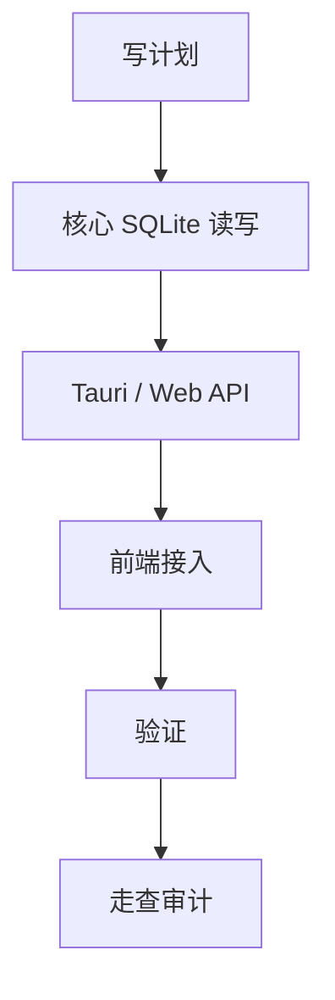

# AI 技能目录 SQLite 持久化 — 实施计划

## 需求与决策

- 需求描述：AI 技能页面的“任务目录 / 技能目录”刷新后不应丢失，用户选择目录后需要持久化到 SQLite。
- 设计决策：复用现有 SQLite `tool_settings` 表，新增 `agentSkills` 工具配置；核心读写放在 `rust_tool_core::storage`，Tauri 与 Web server 入口只做薄封装；前端通过统一 API 读取和保存。
- 用户确认项：无需额外确认；保存时机为选择目录后立即保存，页面加载时优先读取 SQLite 中的目录。

## 架构 / 流程示意



## 系统现状分析

| # | 拦截点 / 现状 | 位置 | 条件 | 影响 |
|---|---------------|------|------|------|
| 1 | 技能目录是页面内存状态 | `frontend/src/pages/AgentSkills.vue` | 刷新页面 | 回到写死默认值 |
| 2 | 现有 SQLite 已有 `tool_settings` 表 | `0001_storage_foundation.sql` | 任意 SQLite 初始化后 | 可复用，无需新增 DDL |
| 3 | Tauri / Web 已有分层入口 | `frontend/src-tauri/src/lib.rs`、`rust_tool_server` | 桌面和 Web | 需要两端都接同一核心函数 |

## 改动清单

| # | 文件 | 操作 | 改动说明 |
|---|------|------|----------|
| 1 | `crates/rust_tool_core/src/storage.rs` | MODIFY | 新增 AgentSkillsSettings 结构和 SQLite 读写函数 |
| 2 | `crates/rust_tool_core/src/lib.rs` | MODIFY | 导出新设置类型和函数 |
| 3 | `frontend/src-tauri/src/lib.rs` | MODIFY | 新增 Tauri command 读写技能配置 |
| 4 | `crates/rust_tool_server/src/routes/workbench.rs` / `app.rs` | MODIFY | 新增 Web API 读写技能配置 |
| 5 | `frontend/src/api/agentSkillsSettings.ts` | NEW | 统一前端 API 适配 Tauri / HTTP |
| 6 | `frontend/src/pages/AgentSkills.vue` | MODIFY | 页面加载和选择目录时读写持久化设置 |

## 精确改动内容

### 改动 1：核心 SQLite 配置

文件：`crates/rust_tool_core/src/storage.rs`

位置：`tool_settings` 相关新函数

```diff
+ pub struct AgentSkillsSettings { script_dir: String }
+ pub async fn get_agent_skills_settings(...)
+ pub async fn save_agent_skills_settings(...)
```

### 改动 2：前端统一配置 API

文件：`frontend/src/api/agentSkillsSettings.ts`

```diff
+ getAgentSkillsSettings()
+ saveAgentSkillsSettings(settings)
```

### 改动 3：页面接入持久化

文件：`frontend/src/pages/AgentSkills.vue`

```diff
- const dir = ref('/Users/ben/work/99_codex')
+ const dir = ref(DEFAULT_AGENT_SKILLS_DIR)
+ onMounted -> 先读配置，再 fetchScripts
+ pickDirectory('dir') -> 保存配置后刷新脚本
```

## 前置确认步骤

- [x] 确认现有 SQLite 有 `tool_settings` 表，可直接复用。
- [x] 确认 AI 技能页面已同时支持 Tauri 与 Web server 运行模式。

## 红线约束

1. 不在前端直接访问 SQLite。
2. 不在 Tauri / server 层写核心 SQL，SQL 读写下沉到 `rust_tool_core`。
3. 不新增不必要表结构；优先复用 `tool_settings`。

## 编码规范约束

- 本次适用规则：`ARCH-001`、`ARCH-002`、`SEC-002`、`EX-001`、`VUE-003`、`VUE-004`。
- SQL 注意事项：使用 `sqlx::query().bind(...)` 参数绑定，禁止字符串拼接 SQL。
- 前端注意事项：通过 `api/` 统一请求层，不在页面散落 raw fetch / invoke 新逻辑。

## 数据库 / 菜单 / 权限

- 数据库：复用 `tool_settings` 表，不新增 migration。
- 菜单 / 权限：不涉及。

## 质量保障

| 类型 | 命令 / 方法 | 预期 |
|------|-------------|------|
| 代码检查 | `git diff --check` | 无输出 |
| Rust 测试 | `cargo test -p rust_tool_core storage::tests::agent_skills_settings_are_saved_and_loaded` | 通过 |
| 全量 Rust 测试 | `cargo test` | 通过 |
| 前端构建 | `pnpm --dir frontend run build` | 通过 |

## 回归测试清单

| 场景 | 类型 | 验证点 | 结果 |
|------|------|--------|------|
| 首次加载 | 正向 | 未保存配置时使用默认目录 | 待验证 |
| 选择目录 | 正向 | 保存目录到 SQLite 并刷新列表 | 待验证 |
| 刷新页面 | 回归 | 页面读取保存目录，不回退写死路径 | 待验证 |
| 无效 / 空配置 | 边界 | 空值归一化为空，前端 fallback 默认目录 | 待验证 |

## 执行顺序



## 风险与回滚

- 风险：Web server 的数据库路径与 Tauri 桌面数据库路径由各自运行环境决定；这是项目既有架构。
- 回滚：移除新增 API 和前端接入，恢复页面内存默认目录。
