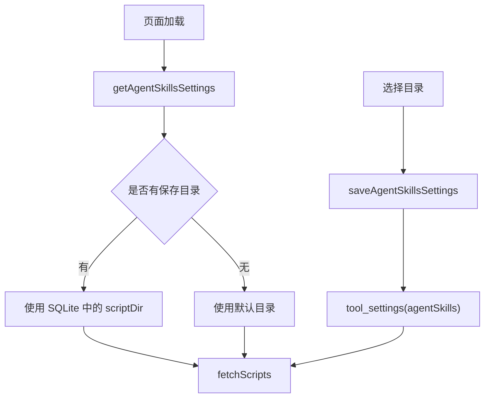

# AI 技能目录 SQLite 持久化 — 走查报告

## 变更概览

- AI 技能目录新增 SQLite 持久化能力，保存到现有 `tool_settings` 表的 `agentSkills` 配置项。
- 页面加载时先读取持久化目录，再拉取脚本列表；用户选择目录后立即保存。
- Tauri 桌面端直接写入当前有效应用 SQLite；Web dev 模式通过新增后端 API 写入 `RUSTTOOL_DATA_DIR` 下的 SQLite，后端不可用时保留 localStorage fallback。

## 关键文件

- `crates/rust_tool_core/src/storage.rs`
  - 新增 `AgentSkillsSettings`。
  - 新增 `get_agent_skills_settings` / `save_agent_skills_settings`。
  - 复用 `tool_settings` 表，未新增 DDL。
- `frontend/src-tauri/src/lib.rs`
  - 新增 `get_agent_skills_settings` / `save_agent_skills_settings` Tauri commands。
- `crates/rust_tool_server/src/routes/workbench.rs`
  - 新增 `/api/workbench/settings/agent-skills` GET / POST。
- `frontend/src/api/agentSkillsSettings.ts`
  - 新增前端统一 API 适配。
- `frontend/src/pages/AgentSkills.vue`
  - 页面初始化读取保存目录。
  - 选择任务目录后保存设置并刷新脚本列表。

## 核心流程

## 验证结果

- `cargo fmt`：通过。
- `git diff --check`：通过。
- `cargo test -p rust_tool_core agent_skills_settings_are_saved_and_loaded`：通过。
- `cargo test -p rust_tool_server test_app_build`：通过。
- `cargo test`：通过，核心库 55 个测试、server 10 个测试均通过。
- `pnpm --dir frontend exec vitest run src/api/agentSkillsSettings.test.ts`：通过，4 个测试通过。
- `pnpm --dir frontend run test:run`：通过，6 个测试文件、44 个测试通过。
- `pnpm --dir frontend run build`：通过。
- 本机 API 验证：
  - 使用 `RUSTTOOL_DATA_DIR=/private/tmp/rusttool-agent-skills-settings` 启动后端。
  - POST `/api/workbench/settings/agent-skills` 保存 `/private/tmp/rusttool-agent-skills-settings/99_codex` 成功。
  - GET `/api/workbench/settings/agent-skills` 可读回相同值。
  - 验证目录生成 `rusttool.db` / WAL / SHM 文件。
- in-app Browser UI 验证：
  - 打开 `http://127.0.0.1:5173/agent-skills` 后页面显示 SQLite 中保存的目录。
  - reload 后仍显示保存目录，未回退到 `/Users/ben/work/99_codex`。
- `cargo clippy --all-targets -- -D warnings`：未通过，阻断仍为既有 `crates/rust_tool_core/src/tools/finalshell_password.rs:149` 的 `manual_is_multiple_of` 提示；本次改动文件未新增 clippy 阻断。

## 风险与注意事项

- 桌面端读写当前有效 SQLite；如果用户在程序配置中切换数据库文件，技能目录配置也会跟随数据库切换。
- Web dev 模式后端默认使用 `./data/rusttool.db`，可通过 `RUSTTOOL_DATA_DIR` 改变数据目录。
- Web 后端不可用时仍 fallback 到 localStorage，避免静态预览完全失效；桌面 Tauri 模式不走 fallback，真实写 SQLite。

## 待用户验证

- 在同事机器上选择一次 AI 技能目录，刷新页面确认目录仍保持为同事本机路径。
- 如果同事使用 Windows 桌面版，确认选择 `.ps1` 脚本所在的 `99_codex` 根目录后刷新仍保留。
