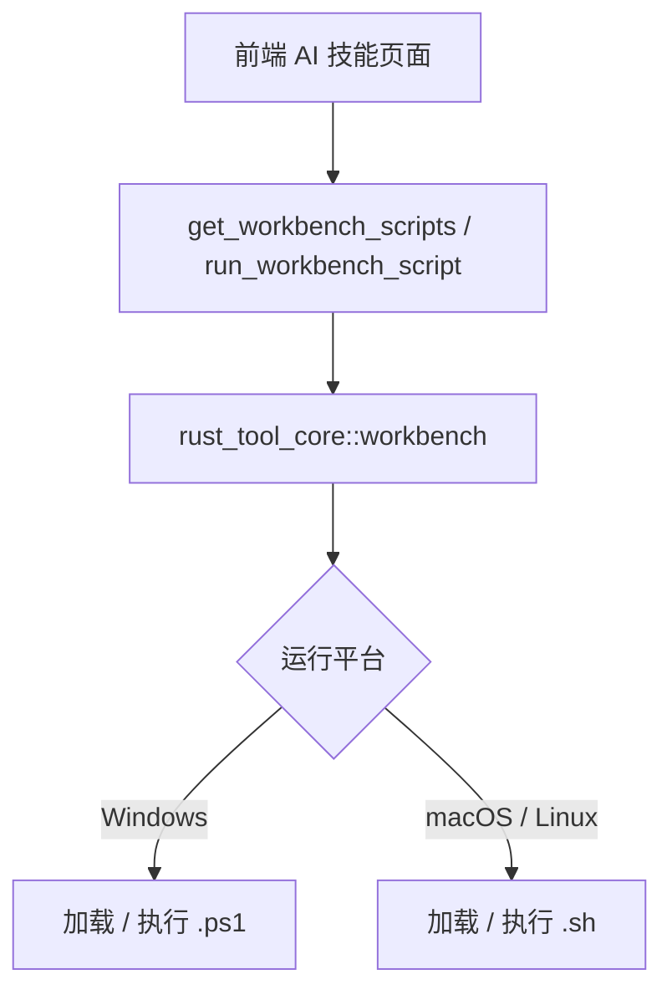
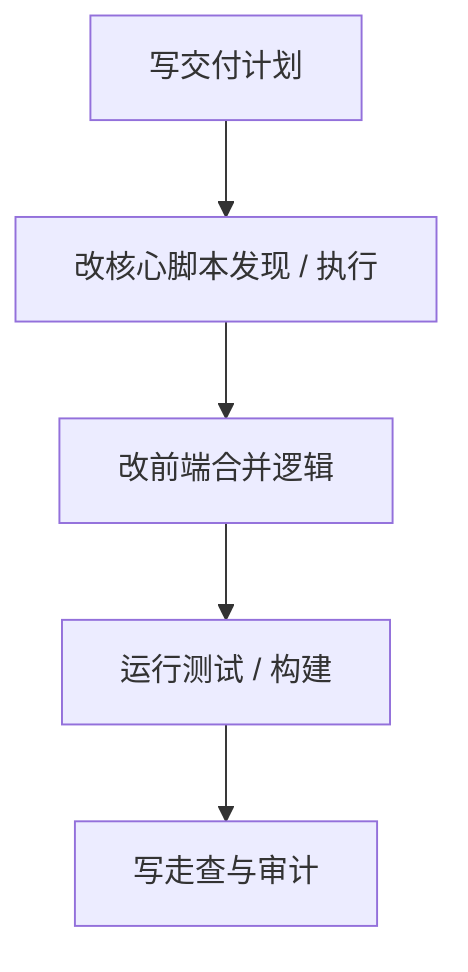

# 平台脚本选择 — 实施计划

## 需求与决策

- 需求描述：AI 技能安装向导需要根据运行平台加载并执行对应脚本，macOS / Linux 使用 `.sh`，Windows 使用 `.ps1`。
- 设计决策：平台判断下沉到 `rust_tool_core::workbench`，保证 Tauri 桌面与 Web server 共用同一套脚本发现和执行逻辑；前端只负责把平台筛选后的安装脚本合并成批量安装入口。
- 用户确认项：无需额外确认；按当前运行平台自动选择脚本扩展。

## 架构 / 流程示意



## 系统现状分析

| # | 拦截点 / 现状 | 位置 | 条件 | 影响 |
|---|---------------|------|------|------|
| 1 | 脚本扫描只收集 `.sh` | `crates/rust_tool_core/src/workbench.rs` | 任意平台 | Windows 新增 `.ps1` 不会出现在 UI |
| 2 | 脚本执行固定 `bash` | `crates/rust_tool_core/src/workbench.rs` | 执行任意脚本 | Windows 无法直接执行 PowerShell 脚本 |
| 3 | 前端安装脚本合并只识别 `.sh` | `frontend/src/pages/AgentSkills.vue` | 批量安装向导 | Windows 安装模块不会被合并为“AI 技能安装向导” |

## 改动清单

| # | 文件 | 操作 | 改动说明 |
|---|------|------|----------|
| 1 | `crates/rust_tool_core/src/workbench.rs` | MODIFY | 增加平台脚本扩展判断和 `.ps1` 执行器 |
| 2 | `frontend/src/pages/AgentSkills.vue` | MODIFY | 安装脚本合并兼容 `.sh` / `.ps1` |
| 3 | `.agents/tasks/260623_platform_script_selection/*` | NEW | 记录计划、任务、走查和审计 |

## 精确改动内容

### 改动 1：平台脚本扩展与执行器

文件：`crates/rust_tool_core/src/workbench.rs`

位置：脚本扫描和 `execute_script`

```diff
- if extension == "sh" { ... }
- let mut cmd = Command::new("bash");
+ if extension == platform_script_extension() { ... }
+ let mut cmd = build_script_command(script_path, extension)?;
```

### 改动 2：前端批量安装识别扩展

文件：`frontend/src/pages/AgentSkills.vue`

位置：`fetchScripts`

```diff
- script.name.endsWith('install-to-project.sh')
+ isInstallToProjectScript(script.name)
```

## 前置确认步骤

- [x] 已确认新增 Windows 脚本路径为 `antigravity/install-to-project.ps1` 与 `codex/install-to-project.ps1`。
- [x] 已确认核心层是桌面与 Web 共用逻辑位置。

## 红线约束

1. 不在 Tauri 或 server 层复制业务逻辑，保持 `rust_tool_core` 同源。
2. 不改变现有安装参数格式：仍传 `项目路径 项目类型`。
3. 不执行非当前平台的脚本，避免 UI 误选和执行器不匹配。

## 编码规范约束

- 本次适用规则：`ARCH-001`、`ARCH-002`、`EX-001`、`CLEAN-001`、`VUE-002`。
- Rust 注意事项：避免 `unwrap()`，失败通过 `Result` 返回清晰错误。
- 前端注意事项：状态字典保持单一辅助函数，不引入额外全局状态。

## 数据库 / 菜单 / 权限

- 不涉及数据库、菜单或权限脚本。

## 质量保障

| 类型 | 命令 / 方法 | 预期 |
|------|-------------|------|
| 代码检查 | `git diff --check` | 无输出 |
| Rust 测试 | `cargo test -p rust_tool_core workbench` | 通过 |
| 前端构建 | `pnpm --dir frontend run build` | 通过 |

## 回归测试清单

| 场景 | 类型 | 验证点 | 结果 |
|------|------|--------|------|
| macOS / Linux 脚本发现 | 正向 | 只加载 `.sh` 安装脚本 | 待验证 |
| Windows 脚本发现 | 正向 | Windows 构建时只加载 `.ps1` 安装脚本 | 待代码推演 |
| 批量安装向导 | 回归 | `antigravity` 与 `codex` 两个安装模块仍合并显示 | 待验证 |
| 非支持扩展执行 | 边界 | 返回清晰错误，不误用 `bash` | 待验证 |

## 执行顺序



## 风险与回滚

- 风险：Windows 环境当前无法在 macOS 直接实机执行 PowerShell 脚本，只能通过条件编译路径和代码审计确认。
- 回滚：恢复 `workbench.rs` 的 `.sh` 固定扫描与 `bash` 固定执行逻辑，并还原前端 `.sh` 过滤条件。
