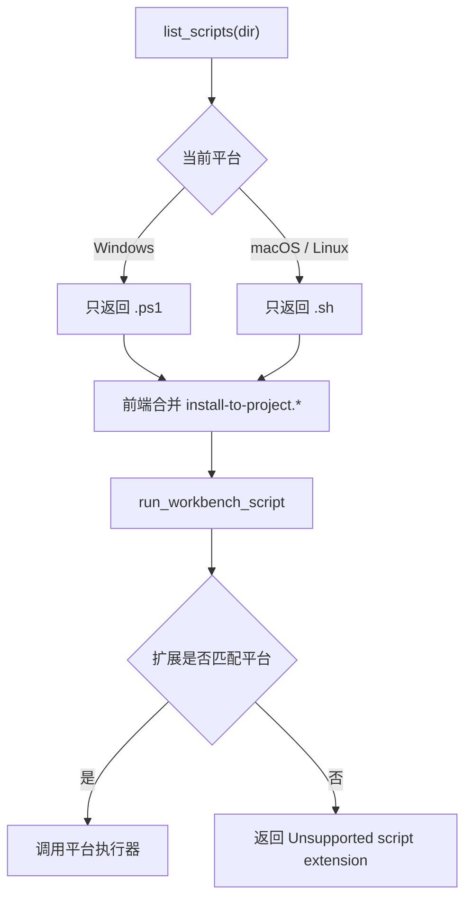

# 平台脚本选择 — 走查报告

## 变更概览

- 脚本发现逻辑改为按当前运行平台过滤：Windows 仅收集 `.ps1`，macOS / Linux 仅收集 `.sh`。
- 脚本执行逻辑改为按平台选择执行器：Windows 使用 `powershell.exe -NoProfile -ExecutionPolicy Bypass -File`，macOS / Linux 使用 `bash`。
- 前端 AI 技能安装向导识别 `install-to-project.sh` 与 `install-to-project.ps1`，由后端平台过滤结果决定实际展示哪一种。

## 关键文件

- `crates/rust_tool_core/src/workbench.rs`
  - 新增平台脚本扩展判断。
  - 执行前校验脚本扩展，避免当前平台误执行不匹配脚本。
  - 新增单测覆盖平台脚本过滤和不匹配扩展拒绝。
- `frontend/src/pages/AgentSkills.vue`
  - 新增 `isInstallToProjectScript`，批量安装入口同时兼容 `.sh` 和 `.ps1` 文件名。

## 核心流程

## 验证结果

- `cargo fmt`：通过。
- `git diff --check`：通过，无输出。
- `cargo test -p rust_tool_core workbench`：通过，2 个定向测试通过。
- `cargo test`：通过，核心库 54 个测试、server 10 个测试均通过。
- `pnpm --dir frontend run build`：通过。
- 本机 API 验证：
  - `GET /api/workbench/scripts?dir=/Users/ben/work/99_codex`
  - macOS 环境返回 `antigravity/install-to-project.sh` 与 `codex/install-to-project.sh`，未返回 `.ps1`。
- in-app Browser UI 验证：
  - `http://127.0.0.1:5173/agent-skills`
  - 安装模块展示 `antigravity/install-to-project.sh`、`codex/install-to-project.sh`。
  - 页面未出现脚本列表加载错误。
- `cargo clippy --all-targets -- -D warnings`：未通过，阻断为既有文件 `crates/rust_tool_core/src/tools/finalshell_password.rs:149` 的 `manual_is_multiple_of` 提示；本次改动文件无新增 clippy 提示。

## 风险与注意事项

- Windows PowerShell 执行路径因当前运行环境为 macOS，未做 Windows 实机 UI 验证；通过条件编译和单测覆盖了平台分支选择。
- 前端仍沿用原有参数字符串格式，未改动路径带空格时的参数拆分行为。

## 待用户验证

- 在 Windows 上打开 AI 技能安装向导，确认安装模块展示 `antigravity/install-to-project.ps1` 与 `codex/install-to-project.ps1`。
- 在 Windows 上执行一次安装向导，确认 PowerShell 脚本可正常完成注入。
